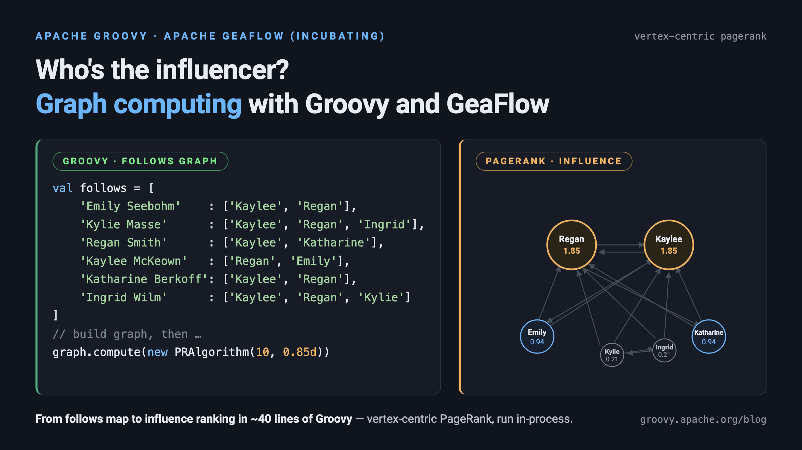

= Graph Computing with Groovy&trade; and Apache GeaFlow (Incubating)
Paul King <paulk-asert|PMC_Member>
:revdate: 2026-08-13T21:00:00+00:00
:keywords: geaflow, apache geaflow, graph computing, streaming graph, pagerank, vertex-centric, pregel, tugraph, gql, groovy
:description: This post looks at using Apache GeaFlow (incubating), a streaming graph computing engine, with Groovy.

++++
<table><tr><td style="padding: 0px; padding-left: 20px; padding-right: 20px; font-size: 18pt; line-height: 1.5; margin: 0px">
++++
[blue]#_Let's explore graph computing with Apache GeaFlow (incubating),
including a Groovy version of vertex-centric PageRank,
and some tips for writing GeaFlow jobs in Groovy._#
++++
</td></tr></table>
++++

== Apache GeaFlow

https://geaflow.apache.org/[Apache GeaFlow] (incubating) is a distributed
streaming graph computing engine. It was originally developed at Ant Group,
where it powers trillion-edge-scale graph workloads for scenarios like
financial risk control, knowledge graphs, social network analysis, and
data warehouse acceleration. It was previously open-sourced under the name
_TuGraph Analytics_, as part of the same TuGraph family as the TuGraph
graph database we looked at in our earlier
https://groovy.apache.org/blog/groovy-graph-databases[Using Graph Databases with Groovy]
post. GeaFlow entered the https://incubator.apache.org/[Apache Incubator]
in June 2025, and its
first Apache releases are now available from Maven Central under the
`org.apache.geaflow` group id.

Where a graph _database_ focuses on storing and querying graphs,
a graph _computing engine_ like GeaFlow focuses on running computations
over graphs: iterative algorithms like PageRank and shortest paths,
multi-hop traversals, and — GeaFlow's speciality — doing this
_incrementally over streaming data_, so that answers stay up-to-date
as new vertices and edges arrive. If you know
https://flink.apache.org/[Apache Flink] or
https://spark.apache.org/[Spark]'s GraphX, GeaFlow sits in a similar space, but with graphs
as first-class citizens.

GeaFlow offers two programming interfaces:

* a *DSL*: SQL blended with ISO/GQL, the recently published international
  standard for graph query languages. Our
  https://groovy.apache.org/blog/groovy-graph-databases[graph databases post]
  mentioned that we expected to see GQL adoption grow "in the not too distant
  future" — GeaFlow is one of the projects making good on that prediction.
* a high-level *API* for the JVM, covering stream, batch, static graph,
  and dynamic graph computation.

The API is a natural fit for Groovy, so that's what we'll explore in
this post.

== Setting up

Our examples use GeaFlow 0.8.0-incubating. The needed dependencies
are on Maven Central. For Gradle, the relevant part of the build file is:

[source,groovy]
----
dependencies {
    implementation "org.apache.groovy:groovy:6.0.0-beta-2"
    implementation "org.apache.geaflow:geaflow-api:$geaflowVersion"
    implementation "org.apache.geaflow:geaflow-pdata:$geaflowVersion"
    implementation "org.apache.geaflow:geaflow-cluster:$geaflowVersion"
    implementation "org.apache.geaflow:geaflow-on-local:$geaflowVersion"
    implementation "org.apache.geaflow:geaflow-pipeline:$geaflowVersion"
}
----

The `geaflow-on-local` module lets us run jobs in a local in-process
environment — ideal for development, testing, and blog posts! The same
job can later be deployed to a Kubernetes cluster using GeaFlow's
console and operator without code changes.

[NOTE]
====
GeaFlow's RPC layer uses libraries which perform deep reflection,
so on JDK 17 and later you should add JVM options such as
`--add-opens=java.base/java.lang=ALL-UNNAMED` when running jobs
(see the accompanying repo for the full set used).
Without them, current GeaFlow versions can appear to hang at startup
while a swallowed `InaccessibleObjectException` is retried —
hopefully something that will improve in future versions.
====

== A social network case study

Fans of our
https://groovy.apache.org/blog/groovy-graph-databases[graph databases post]
will recall that it modelled the women's 100m backstroke results at recent
Olympics, where the Olympic record tumbled seven times across two games.
Let's revisit that cast of swimmers, but this time imagine they are part
of a social network. We'll suppose our swimmers follow one another
as captured in this map:

[source,groovy]
----
val follows = [
    'Emily Seebohm'    : ['Kaylee McKeown', 'Regan Smith'],
    'Kylie Masse'      : ['Kaylee McKeown', 'Regan Smith', 'Ingrid Wilm'],
    'Regan Smith'      : ['Kaylee McKeown', 'Katharine Berkoff'],
    'Kaylee McKeown'   : ['Regan Smith', 'Emily Seebohm'],
    'Katharine Berkoff': ['Kaylee McKeown', 'Regan Smith'],
    'Ingrid Wilm'      : ['Kaylee McKeown', 'Regan Smith', 'Kylie Masse']
]
----

The keys of the map are the followers, and the values are the lists of
swimmers they follow. (If you haven't seen `val` before, it arrived in
Groovy 6: like `var`, it declares a type-inferred local variable, but
a final one.) Who are the influencers in this network?
The classic algorithm for answering that question is
https://en.wikipedia.org/wiki/PageRank[PageRank], originally used
to rank web pages, but equally applicable to any directed graph.

GeaFlow supports _vertex-centric_ graph computation, in the style
popularised by Google's Pregel. Each vertex repeatedly receives messages
from its neighbors, updates its own value, and sends new messages along
its edges, until the requested number of iterations is complete.
This model might feel a little unusual the first time you see it, but it's
what allows the same algorithm to scale from our six swimmers to
billions of vertices partitioned across a cluster.

== PageRank with the Graph API

First, we turn our `follows` map into GeaFlow vertices and edges.
Vertices have a key (the swimmer's name) and a value (their rank,
initially 1.0). Edges have source and target keys, plus an optional
value which we won't use:

[source,groovy]
----
val vertices = follows.keySet().collect {
    new ValueVertex<>(it, 1d)
}
val edges = follows.collectMany { follower, followed ->
    followed.collect { new ValueEdge<>(follower, it, 1) }
}
----

GeaFlow jobs read their data through _sources_. GeaFlow provides
file-based and connector-based sources, but writing our own source
backed by an in-memory list is only a few lines of Groovy
(see `CollectionSource` in the accompanying repo, modelled on the
`FileSource` class from GeaFlow's own examples).

A job is expressed as a `PipelineTask`. We build sources for our
vertices and edges, describe the _graph view_ that will hold the graph,
and then compute over it:

[source,groovy]
----
static class PRTask implements PipelineTask {
    @Override
    void execute(IPipelineTaskContext ctx) {
        // ... follows, vertices, edges as above ...

        val vertexSource =
            ctx.buildSource(new CollectionSource<IVertex<String, Double>>(vertices),
                AllWindow.getInstance())
        val edgeSource =
            ctx.buildSource(new CollectionSource<IEdge<String, Integer>>(edges),
                AllWindow.getInstance())

        val graphViewDesc = GraphViewBuilder.createGraphView(GraphViewBuilder.DEFAULT_GRAPH)
            .withShardNum(1)
            .withBackend(IViewDesc.BackendType.Memory)
            .build()

        val graph = ctx.buildWindowStreamGraph(vertexSource, edgeSource, graphViewDesc)

        graph.compute(new PRAlgorithm(10, 0.85d))
            .compute(1)
            .getVertices()
            .sink(new ConsoleSink())
    }
}
----

A few things to note:

* We're writing idiomatic dynamic Groovy here — no explicit types are
  needed for the sources or the graph. If you prefer compile-time type
  checking, adding `@CompileStatic` works too, at the cost of a few
  explicit generic types to help inference along.
* `AllWindow` tells GeaFlow to read all of the data as one batch,
  giving _static_ graph computation. Size-based tumbling windows are
  used instead when processing _streaming_ data incrementally.
* The graph view here uses the `Memory` backend. RocksDB and other
  backends are available for graphs that don't fit in memory.
* `withShardNum` and the parallelism arguments are all 1 for our
  tiny example but are the knobs used to scale out on a cluster.

The algorithm itself extends `VertexCentricCompute` and supplies a
compute function. Here is PageRank expressed in that style:

[source,groovy]
----
static class PRAlgorithm extends VertexCentricCompute<String, Double, Integer, Double> {
    double alpha

    PRAlgorithm(long iterations, double alpha) {
        super(iterations)
        this.alpha = alpha
    }

    @Override
    VertexCentricComputeFunction<String, Double, Integer, Double> getComputeFunction() {
        new PRComputeFunction(alpha: alpha)
    }

    @Override
    VertexCentricCombineFunction<Double> getCombineFunction() {
        null
    }
}

static class PRComputeFunction implements VertexCentricComputeFunction<String, Double, Integer, Double> {
    double alpha
    VertexCentricComputeFunction.VertexCentricComputeFuncContext<String, Double, Integer, Double> context

    @Override
    void init(VertexCentricComputeFunction.VertexCentricComputeFuncContext<String, Double, Integer, Double> ctx) {
        context = ctx
    }

    @Override
    void compute(String vertexId, Iterator<Double> messages) {
        val vertex = context.vertex().get()
        val outEdges = context.edges().outEdges
        if (context.iterationId == 1L) {
            if (outEdges) {
                context.sendMessageToNeighbors(vertex.value / outEdges.size() as double)
            }
        } else {
            double sum = messages.sum(0d)
            double pr = sum * alpha + (1 - alpha)
            context.setNewVertexValue(pr)
            if (outEdges) {
                context.sendMessageToNeighbors(pr / outEdges.size())
            }
        }
    }

    @Override
    void finish() { }
}
----

In the first iteration, each swimmer shares their influence equally
among everyone they follow. In subsequent iterations, each swimmer's
influence is recalculated from the messages received from their
followers, damped by the usual PageRank `alpha` factor, and shared
again. Groovy niceties like `messages.sum()`, Groovy truth for the
`outEdges` check, and the named-argument constructor keep the code
pleasantly compact.

A simple sink prints the results:

[source,groovy]
----
static class ConsoleSink implements SinkFunction<IVertex<String, Double>> {
    @Override
    void write(IVertex<String, Double> v) {
        printf '%-17s has influence %.2f%n', v.id, v.value
    }
}
----

Finally, the main method creates a local environment, submits the task,
and runs it:

[source,groovy]
----
static void main(String[] args) {
    val environment = EnvironmentFactory.onLocalEnvironment()
    val pipeline = PipelineFactory.buildPipeline(environment)
    pipeline.submit(new PRTask())
    val result = pipeline.execute()
    result.get()
    environment.shutdown()
    System.exit(0)
}
----

Running it starts an in-process mini-cluster (master, container, and
driver all within our JVM) and completes in a few seconds with:

----
Emily Seebohm     has influence 0.94
Regan Smith       has influence 1.85
Kylie Masse       has influence 0.21
Katharine Berkoff has influence 0.94
Ingrid Wilm       has influence 0.21
Kaylee McKeown    has influence 1.85
----

The two swimmers who traded the Olympic record back and forth,
Kaylee McKeown and Regan Smith, come out on top — as our hypothetical
follower graph intended. Phew!

== A note on serialization

GeaFlow is a distributed system. Tasks and functions are serialized
and shipped across process boundaries — even in local mode. So, write
your tasks, sources, sinks, and compute functions as classes (as we did
above), or, with static compilation, as lambda expressions or method
references — all of these serialize cleanly. Avoid closures for these
particular functions: they are converted to dynamic proxies which
GeaFlow won't currently transport. More details, including a related
method reference issue affecting earlier Groovy versions
(https://issues.apache.org/jira/browse/GROOVY-11993[GROOVY-11993],
fixed in Groovy 6), can be found in the accompanying repo.

== What else is in the box?

We've only scratched the surface of GeaFlow with our little example.
Other parts of the project worth knowing about:

* The *SQL+GQL DSL*. GeaFlow jobs can be written in SQL blended with
  ISO/GQL graph pattern matching. Here's the heart of GeaFlow's
  real-time loop-detection demo, which continuously finds 4-hop cycles
  as edges stream in:
+
[source,sql]
----
INSERT INTO tbl_result
SELECT DISTINCT a_id, b_id, c_id, d_id, a1_id
FROM (
  MATCH (a:person) -[:knows]->(b:person) -[:knows]-> (c:person)
        -[:knows]-> (d:person) -> (a:person)
  RETURN a.id as a_id, b.id as b_id, c.id as c_id, d.id as d_id, a.id as a1_id
);
----
* *Connectors* for the DSL covering files, sockets,
  https://kafka.apache.org/[Kafka], https://pulsar.apache.org/[Pulsar],
  https://hive.apache.org/[Hive], JDBC, https://hbase.apache.org/[HBase],
  Elasticsearch, https://hudi.apache.org/[Hudi],
  https://paimon.apache.org/[Paimon], and even Neo4j.
* *Dynamic graph computation*: the same vertex-centric algorithms can
  run incrementally against a graph view that is continuously updated
  from streaming vertex and edge sources — GeaFlow's headline feature,
  and a great topic for a future post.
* A web *console* for submitting and managing jobs, and Kubernetes
  support for cluster deployment.
* Some intriguing AI-adjacent modules, including `geaflow-mcp`
  (an MCP server for querying GeaFlow) and `geaflow-ai` (a graph-based
  memory server for AI agents).

== Conclusion

We have looked at Apache GeaFlow (incubating), seen its connection to
technologies from our earlier graph databases post, and run a
vertex-centric PageRank written in Groovy on it. We've also gathered
some practical tips for pairing Groovy with GeaFlow's distributed
runtime. We wish the GeaFlow community well on its incubation journey!

The code for the examples in this post can be found here:

https://github.com/paulk-asert/groovy-geaflow

[NOTE]
====
Apache GeaFlow is an effort undergoing incubation at The Apache Software
Foundation (ASF), sponsored by the Apache Incubator.
https://incubator.apache.org/[Incubation] is
required of all newly accepted projects until a further review indicates
that the infrastructure, communications, and decision making process have
stabilized in a manner consistent with other successful ASF projects.
====
