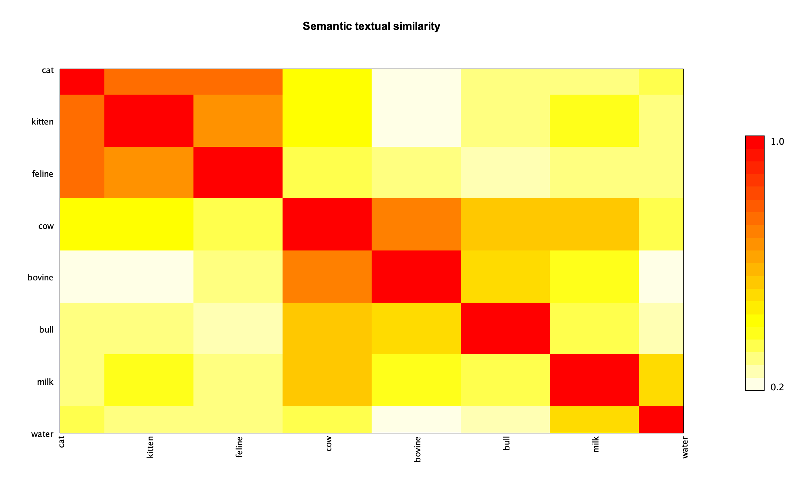
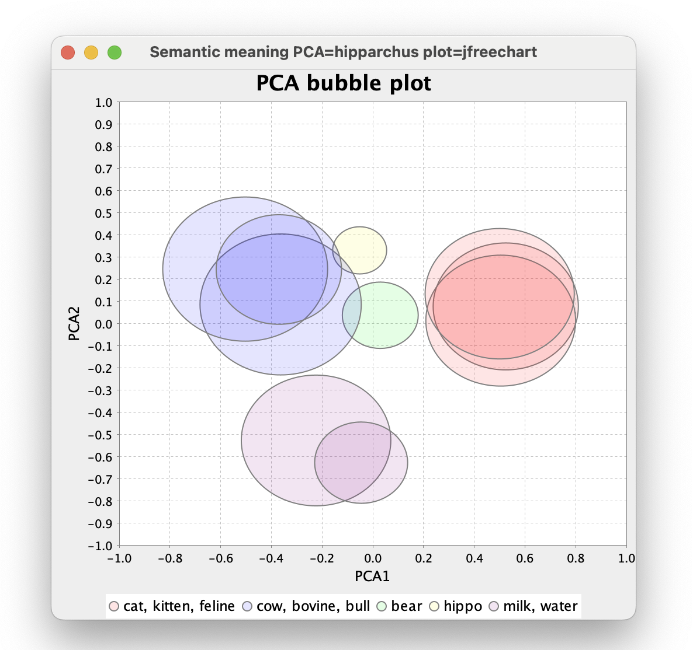

= Groovy Text Similarity
Paul King
:revdate: 2025-02-01T20:30:00+00:00
:draft: true
:keywords: groovy, deep learning, apache commons
:description: This blog looks at processing some algorithms for testing text similarity.

== Introduction

Let's build a wordle-like word guessing game. But instead of telling you how many
correct and misplaced letters, we'll give you more hints, but slightly less obvious
ones, to make it a little more challenging!

We won't (directly) even tell you how many letters are in the word,
but we'll give hints like:

* How close your guess sounds like the hidden word.
* How close your guess is to the meaning of the hidden word.
* Instead of correct and misplaced letters, we'll give you some distance
and similarity measures which will give you clues about how many
correct letters you have, do you have the correct letters in order
and so forth.

== Background

String similarity tries to answer the question: is one word
(or phrase, sentence, paragraph, document) the same as, or similar to, another.
This is an important capability in many scenarios involving searching
or asking questions or invoking commands.
It can help answer questions like:

* Are two Jira/GitHub issues duplicates of the same issue?
* Are two (or more) customer records actually for the same customer?
* Is some social media topic trending because multiple posts which, even though they contain
slightly different words, are really about the same thing?
* Can I understand some natural language customer request even when it contains spelling mistakes?
* As a doctor, can I find a medical journal paper discussing a patient's medical diagnosis/symptoms/treatment?
* As a programmer, can I find a solution to my coding problem?

When comparing two things to see if they are the same,
we often want to incorporate a certain amount of fuzziness:

* Are two words the same except for case? E.g. `cat` and `Cat`.
* Are two words the same except for spelling variations?
E.g. `Clare`, `Claire`, and `Clair`.
* Are two words the same except for a misspelling or typo?
E.g. `mathematiks`, and `computter`.
* Are two phrases the same except for order and/or inconsequential words?
E.g. `the red car` and `the car of colour red`
* Do the words sound the same?
E.g. `there` , `their`, and `they're`
* Are the words variations meaning the same (or similar) thing?
E.g. `cow`, `bull`, `calf`, `bovine`, `cattle`, or `livestock`

Very simple cases can typically be explicitly catered for by hand, e.g.
using String library methods or regular expressions:

[source.groovy]
----
assert 'Cat'.equalsIgnoreCase('cat')

assert ['color', 'Colour'].every { it =~ '[Cc]olou?r' }
----

Handling cases explicitly like this soon becomes tedious.
We'll look at some libraries which can help us handle comparisons
in more general ways.

First, we'll examine two libraries for performing similarity matching using string metrics:

* `info.debatty:java-string-similarity`
* `org.apache.commons:commons-text` Apache Commons Text

Then we'll look at some libraries for phonetic matching:

* `commons-codec:commons-codec` Apache Commons Codec for Soundex and Metaphone
* `org.openrefine:main` OpenRefine for Metaphone3

Then we'll look at some deep learning options for increased semantic matching:

* `org.deeplearning4j:deeplearning4j-nlp` for Glove and ConceptNet models
* `ai.djl` with Pytorch for a universal-sentence-encoder model and Tensorflow with an Angle model

== Simple String Metrics

String metrics provide some sort of measure of the sameness of the characters in words (or phrases). These algorithms generally compute similarity or distance (inverse similarity).

There are numerous tutorials that describe various string metric algorithms. We won't replicate those tutorials but here is a summary of some common ones:

[cols="2,7"]
|===
| Algorithm |Description

| https://en.wikipedia.org/wiki/Levenshtein_distance[Levenshtein]
| The minimum number of "edits" (inserts, deletes, or substitutions) required to convert from one word to another.
Distance between `kitten` and `sitting` is 3 (swap `s` for `k`, swap `i` for `e`, add `g` at end).
Distance between `grounds` and `aground` is 2 (add `a` at start, remove `s` at end).
https://en.wikipedia.org/wiki/Damerau%E2%80%93Levenshtein_distance[Damerau–Levenshtein distance]
is a variant that allows transposition of two adjacent letters to count as a single edit.

| https://en.wikipedia.org/wiki/Jaccard_index[Jaccard]
| Defines a ratio between two sample sets. This could be sets of
characters in a word, or words in a sentence, or sets of `k` consecutive characters in a phrase.
The ratio is the _intersection_ of sets divided by the _union_ of sets.
`bear` vs `bare` would be 100%, `pair` vs `pear` would be 60%.

| https://en.wikipedia.org/wiki/Hamming_distance[Hamming]
| Similar to Levenshtein but insertions and deletions aren't allowed.
Distance between `black` and `block` is 1 (swap `o` for `a`).
Distance between `grounds` and `aground` is 7 (swap all chars since none are in the correct position).

| https://en.wikipedia.org/wiki/Longest_common_subsequence[LongestCommonSubsequence]
| The maximum number of characters appearing in order in the two words, not necessarily consecutively.
LCS of `grounds` and `aground` is 6 (`ground`).
LCS of `string` and `single` is 4 (`s`, `i`, `n`, `g`).
It accounts for insertions and deletions but not substitutions.

| https://en.wikipedia.org/wiki/Jaro%E2%80%93Winkler_distance[Jaro–Winkler]
| This is a metric also measuring edit distance but weights edits to favor
words with common prefixes.
JaroWinkler of `ground` and `groudn` (last two letters swapped) is 0.97.
JaroWinkler of `ground` and `rgound` (first two letters swapped) is 0.94.

|===

You may be wondering what practical use these algorithms might have.
Longest commons subsequence is the algorithm behind the popular `diff` tool.

Groovy has in fact a built-in example of a variant of the Levenshtein measure
it uses for error reporting. Groovy uses a variant known as the Damerau-Levenshtein distance.
This variant counts transposing two adjacent characters within the original word as one "edit".
The Levenshtein distance of `fish` and ifsh` is 2.
The Damerau-Levenshtein distance of `fish` and ifsh` is 1.

As an example, for this code:

[source,groovy]
----
'foo'.toUpper()
----

Groovy will give this error message:

----
No signature of method: java.lang.String.toUpper() is applicable for argument types: () values: []
Possible solutions: toUpperCase(), toURI(), toURL(), toURI(), toURL(), toSet()
----

And this code:

[source,groovy]
----
'foo'.touppercase()
----

Gives this error:

----
No signature of method: java.lang.String.touppercase() is applicable for argument types: () values: []
Possible solutions: toUpperCase(), toUpperCase(java.util.Locale), toLowerCase(), toLowerCase(java.util.Locale)
----

The values returned as possible solutions are the best methods found for the String
class according the Damerau-Levenshtein distance but with some smarts added to
cater for closest matching parameters. This includes Groovy's String extension methods
and (if using dynamic metaprogramming) any methods added at runtime.

NOTE: You'll frequently get feedback about using incorrect methods from your IDE
or the Groovy compiler (with static checking enabled). But having this feedback
provides a great fallback especially when using Groovy scripts outside an IDE.

Let's now look at some examples of running various string metric algorithms.
We'll use algorithm from Apache Commons Text and the `info.debatty:java-string-similarity`
library.

Both these libraries support numerous string metric classes.
Methods to calculate both similarity and distance are provided.
We'll look at both in turn.

First, let's look at some similarity measures.
These typically range from 0 (meaning no similarity)
to 1 (meaning they are the same).

We'll look at the following subset of similarity measures
from the two libraries. Note that there is a fair bit of overlap
between the two libraries. We'll do a little cross-checking
between the two libraries but won't compare them exhaustively.

[source,groovy]
----
var simAlgs = [
    NormalizedLevenshtein: new NormalizedLevenshtein()::similarity,
    'Jaccard (debatty k=1)': new Jaccard(1)::similarity,
    'Jaccard (debatty k=2)': new Jaccard(2)::similarity,
    'Jaccard (debatty k=3)': new Jaccard()::similarity,
    'Jaccard (commons text k=1)': new JaccardSimilarity()::apply,
    'JaroWinkler (debatty)': new JaroWinkler()::similarity,
    'JaroWinkler (commons text)': new JaroWinklerSimilarity()::apply,
    RatcliffObershelp: new RatcliffObershelp()::similarity,
    SorensenDice: new SorensenDice()::similarity,
    Cosine: new Cosine()::similarity,
]
----

In the sample code, we run these measures for the following pairs:

[source,groovy]
----
var pairs = [
    ['there', 'their'],
    ['cat', 'hat'],
    ['cat', 'kitten'],
    ['cat', 'dog'],
    ['bear', 'bare'],
    ['bear', 'bean'],
    ['pair', 'pear'],
    ['sort', 'sought'],
    ['cow', 'bull'],
    ['winning', 'grinning'],
    ['knows', 'nose'],
    ['ground', 'aground'],
    ['grounds', 'aground'],
    ['peeler', 'repeal'],
    ['hippo', 'hippopotamus'],
    ['kangaroo', 'kangarxx'],
    ['kangaroo', 'xxngaroo'],
    ['elton john', 'john elton'],
    ['elton john', 'nhoj notle'],
    ['my name is Yoda', 'Yoda my name is'],
    ['the cat sat on the mat', 'the fox jumped over the dog'],
    ['poodles are cute', 'dachshunds are delightful']
]
----

Here is the output from the first pair:

++++
<pre>
      there VS their
JaroWinkler (commons text)      0.91 ██████████████████
JaroWinkler (debatty)           0.91 ██████████████████
Jaccard (debatty k=1)           0.80 ████████████████
Jaccard (commons text k=1)      0.80 ████████████████
RatcliffObershelp               0.80 ████████████████
NormalizedLevenshtein           0.60 ████████████
Cosine                          0.33 ██████
Jaccard (debatty k=2)           0.33 ██████
SorensenDice                    0.33 ██████
Jaccard (debatty k=3)           0.20 ████
</pre>
++++

We have color coded the bars in the chart with 80% and above colored green deeming it a "match" in terms of similarity.
You could choose some different threshold for matching depending on your use case.

We can see that the different algorithms rank the similarity of the two words differently.

Rather than show the results of all algorithms for all pairs, let's just show a few highlights
that give us insight into which similarity measures might be most useful for our game.

A first observation is the usefulness of Jaccard with k=1 (looking at the set of individual letters).
Here we can imagine that `bear` might be our guess and `bare` might be the hidden word.

++++
<pre>
      bear VS bare
Jaccard (debatty k=1)           1.00 ████████████████████
</pre>
++++

Here we know that we have correctly guessed all the letters!

For another example:

++++
<pre>
      cow VS bull
Jaccard (debatty k=1)           0.00 ▏
</pre>
++++

We can rule out all letters from our guess!

What about Jaccard looking at multi-letter sequences? Well, if you were trying to determine
whether a social media account `@elton_john` might be the same person as the email `john.elton@gmail.com`,
Jaccard with higher indexes would help you out.

++++
<pre>
      elton john VS john elton
Jaccard (debatty k=1)           1.00 ████████████████████
Jaccard (debatty k=2)           0.80 ████████████████
Jaccard (debatty k=3)           0.45 █████████

      elton john VS nhoj notle
Jaccard (debatty k=1)           1.00 ████████████████████
Jaccard (debatty k=2)           0.00 ▏
Jaccard (debatty k=3)           0.00 ▏
</pre>
++++

Note that for "Elton John" backwards, Jaccard with higher values of k quickly drops to zero but just swapping
the words (like our social media account and email with punctuation removed) remains high. So higher value
values of k for Jaccard definitely have there place but perhaps not needed for our game.

++++
<pre>
      bear VS bean
JaroWinkler (commons text)      0.88 █████████████████
JaroWinkler (debatty)           0.88 █████████████████
NormalizedLevenshtein           0.75 ███████████████
RatcliffObershelp               0.75 ███████████████
Jaccard (debatty k=1)           0.60 ████████████
Jaccard (commons text k=1)      0.60 ████████████
Jaccard (debatty k=2)           0.50 ██████████
SorensenDice                    0.50 ██████████
Cosine                          0.50 █████████
Jaccard (debatty k=3)           0.33 ██████
</pre>
++++

== Phonetic Algorithms

https://en.wikipedia.org/wiki/Phonetic_algorithm[Phonetic algorithms] map words into representations of their pronunciation. They are often used for spell checkers, searching, data deduplication and speech to text systems.

One of the earliest phonetic algorithms was https://en.wikipedia.org/wiki/Soundex[Soundex].
The idea is that similar sounding words will have the same soundex encoding despite minor differences in spelling, e.g. Claire, Clair, and Clare, all have the same soundex encoding.
A summary of soundex is that (all but leading) vowels are dropped and similar sounding consonants are
grouped together. Commons codec has several soundex algorithms. The most commonly used
ones for the English language are shown below:

++++
<pre>
Pair                Soundex                RefinedSoundex         DaitchMokotoffSoundex
cat|hat             C300|H300              C306|H06               430000|530000
bear|bare           B600|B600              B109|B1090             790000|790000
pair|pare           P600|P600              P109|P1090             790000|790000
there|their         T600|T600              T6090|T609             390000|390000
sort|sought         S630|S230              S3096|S30406           493000|453000
cow|bull            C000|B400              C30|B107               470000|780000
winning|grinning    W552|G655              W08084|G4908084        766500|596650
knows|nose          K520|N200              K3803|N8030            567400|640000
ground|aground      G653|A265              G49086|A049086         596300|059630
peeler|repeal       P460|R140              P10709|R90107          789000|978000
hippo|hippopotamus  H100|H113              H010|H0101060803       570000|577364

</pre>
++++

Another common phonetic algorithm is https://en.wikipedia.org/wiki/Metaphone[Metaphone].
This is similar in concept to Soundex but uses a more sophisticated algorithm for encoding.
Various versions are available. Commons codec supports Metaphone and Double Metaphone.
The https://github.com/OpenRefine/OpenRefine[openrefine] project includes an early version of Metaphone 3.

++++
<pre>
Pair                Metaphone        Metaphone(8)     DblMetaphone(8)  Metaphone3
cat|hat             KT|HT            KT|HT            KT|HT            KT|HT
bear|bare           BR|BR            BR|BR            PR|PR            PR|PR
pair|pare           PR|PR            PR|PR            PR|PR            PR|PR
there|their         0R|0R            0R|0R            0R|0R            0R|0R
sort|sought         SRT|ST           SRT|ST           SRT|SKT          SRT|ST
cow|bull            K|BL             K|BL             K|PL             K|PL
winning|grinning    WNNK|KRNN        WNNK|KRNNK       ANNK|KRNNK       ANNK|KRNNK
knows|nose          NS|NS            NS|NS            NS|NS            NS|NS
ground|aground      KRNT|AKRN        KRNT|AKRNT       KRNT|AKRNT       KRNT|AKRNT
peeler|repeal       PLR|RPL          PLR|RPL          PLR|RPL          PLR|RPL
hippo|hippopotamus  HP|HPPT          HP|HPPTMS        HP|HPPTMS        HP|HPPTMS

</pre>
++++

Commons Codec includes some additional algorithms including https://en.wikipedia.org/wiki/New_York_State_Identification_and_Intelligence_System[Nysiis] and https://en.wikipedia.org/wiki/Caverphone[Caverphone]. They are shown below for completeness.

++++
<pre>
Pair                Nysiis                 Caverphone2
cat|hat             CAT|HAT                KT11111111|AT11111111
bear|bare           BAR|BAR                PA11111111|PA11111111
pair|pare           PAR|PAR                PA11111111|PA11111111
there|their         TAR|TAR                TA11111111|TA11111111
sort|sought         SAD|SAGT               ST11111111|ST11111111
cow|bull            C|BAL                  KA11111111|PA11111111
winning|grinning    WANANG|GRANAN          WNNK111111|KRNNK11111
knows|nose          N|NAS                  KNS1111111|NS11111111
ground|aground      GRAD|AGRAD             KRNT111111|AKRNT11111
peeler|repeal       PALAR|RAPAL            PLA1111111|RPA1111111
hippo|hippopotamus  HAP|HAPAPA             APA1111111|APPTMS1111

</pre>
++++

The matching of `sort` with `sought` by Caverphone2 is useful but it didn't match
`knows` with `nose`. In summary, these
algorithms don't offer anything compelling compared with Metaphone.

For our game, we don't want users to have to understand the encoding algorithms of
the various phonetic algorithms. We want to instead give them a metric that lets them know
how closely their guess sounds like the hidden word.

++++
<pre>
Pair                SoundexDiff    Metaphone5LCS  Metaphone5Lev
cat|hat             75%            50%            50%
bear|bare           100%           100%           100%
pair|pare           100%           100%           100%
there|their         100%           100%           100%
sort|sought         75%            67%            67%
cow|bull            50%            0%             0%
winning|grinning    25%            60%            60%
knows|nose          25%            100%           100%
ground|aground      0%             80%            80%
peeler|repeal       25%            67%            33%
hippo|hippopotamus  50%            40%            40%

</pre>
++++

== Going Deeper

Using DJL with PyTorch and the Angle model:

----
    cow
bovine (0.86)
bull (0.73)
Bovines convert grass to milk (0.60)
hay (0.59)
Bulls consume hay (0.56)

    cat
kitten (0.82)
bull (0.63)
bovine (0.60)
One two three (0.59)
hay (0.55)

    dog
bull (0.69)
bovine (0.68)
kitten (0.58)
Dogs play in the grass (0.58)
Dachshunds are delightful (0.55)

    grass
The grass is green (0.83)
hay (0.68)
Dogs play in the grass (0.65)
Bovines convert grass to milk (0.61)
Bulls trample grass (0.59)

    Cows eat grass
Bovines convert grass to milk (0.80)
Bulls consume hay (0.69)
Bulls trample grass (0.68)
Dogs play in the grass (0.65)
bovine (0.62)

    Poodles are cute
Dachshunds are delightful (0.63)
Dogs play in the grass (0.56)
bovine (0.49)
The grass is green (0.44)
kitten (0.44)

    The water is turquoise
The sea is blue (0.72)
The sky is blue (0.65)
The grass is green (0.53)
One two three (0.43)
bovine (0.39)
----

Using DJL with Tensorflow and the UAE model:

----
    cow
bovine (0.72)
bull (0.57)
Bulls consume hay (0.46)
hay (0.45)
kitten (0.44)

    cat
kitten (0.75)
bull (0.35)
hay (0.31)
bovine (0.26)
Dogs play in the grass (0.22)

    dog
kitten (0.54)
Dogs play in the grass (0.45)
bull (0.39)
hay (0.35)
Dachshunds are delightful (0.27)

    grass
The grass is green (0.61)
Bulls trample grass (0.56)
Dogs play in the grass (0.52)
hay (0.51)
Bulls consume hay (0.47)

    Cows eat grass
Bovines convert grass to milk (0.60)
Bulls trample grass (0.58)
Dogs play in the grass (0.56)
Bulls consume hay (0.53)
bovine (0.44)

    Poodles are cute
Dachshunds are delightful (0.54)
Dogs play in the grass (0.27)
Bulls consume hay (0.19)
bovine (0.16)
Bulls trample grass (0.15)

    The water is turquoise
The sea is blue (0.56)
The grass is green (0.39)
The sky is blue (0.38)
kitten (0.17)
One two three (0.17)
----

----
Algorithm            conceptnet

               /c/fr/vache    █████████▏
               /c/de/kuh      █████████▏
/c/en/cow      /c/en/bovine   ███████▏
               /c/fr/bovin    ███████▏
               /c/en/bull     █████▏

               /c/fr/taureau  █████████▏
               /c/en/cow      █████▏
/c/en/bull     /c/fr/vache    █████▏
               /c/de/kuh      █████▏
               /c/fr/bovin    █████▏

               /c/de/kuh      █████▏
               /c/en/cow      █████▏
/c/en/calf     /c/fr/vache    █████▏
               /c/en/bovine   █████▏
               /c/fr/bovin    █████▏

               /c/fr/bovin    █████████▏
               /c/en/cow      ███████▏
/c/en/bovine   /c/de/kuh      ███████▏
               /c/fr/vache    ███████▏
               /c/en/calf     █████▏

               /c/en/bovine   █████████▏
               /c/fr/vache    ███████▏
/c/fr/bovin    /c/de/kuh      ███████▏
               /c/en/cow      ███████▏
               /c/fr/taureau  █████▏

               /c/en/cow      █████████▏
               /c/de/kuh      █████████▏
/c/fr/vache    /c/fr/bovin    ███████▏
               /c/en/bovine   ███████▏
               /c/fr/taureau  █████▏

               /c/en/bull     █████████▏
               /c/fr/bovin    █████▏
/c/fr/taureau  /c/fr/vache    █████▏
               /c/en/cow      █████▏
               /c/de/kuh      █████▏

               /c/en/cow      █████████▏
               /c/fr/vache    █████████▏
/c/de/kuh      /c/fr/bovin    ███████▏
               /c/en/bovine   ███████▏
               /c/en/calf     █████▏

               /c/en/cat      ████████▏
               /c/de/katze    ████████▏
/c/en/kitten   /c/en/bull     ██▏
               /c/en/cow      █▏
               /c/de/kuh      █▏

               /c/de/katze    █████████▏
               /c/en/kitten   ████████▏
/c/en/cat      /c/en/bull     ██▏
               /c/en/cow      ██▏
               /c/fr/taureau  █▏

               /c/en/cat      █████████▏
               /c/en/kitten   ████████▏
/c/de/katze    /c/en/bull     ██▏
               /c/de/kuh      ██▏
               /c/fr/taureau  ██▏
----

----
Algorithm       angle                use                  conceptnet           glove                fasttext

              bovine    ████████▏  bovine    ███████▏   bovine    ███████▏   bovine    ██████▏    bovine    ███████▏
              cattle    ████████▏  cattle    ███████▏   cattle    ███████▏   cattle    ██████▏    cattle    ███████▏
cow           calf      ████████▏  calf      ██████▏    livestock ██████▏    milk      ████▏      calf      ██████▏
              milk      ███████▏   livestock ██████▏    bull      █████▏     livestock ████▏      bull      ██████▏
              bull      ███████▏   bull      █████▏     calf      █████▏     calf      ████▏      milk      ██████▏

              bear      ███████▏   cow       █████▏     cow       █████▏     cow       ███▏       cow       ██████▏
              cow       ███████▏   cattle    █████▏     cattle    █████▏     bear      ███▏       cattle    █████▏
bull          cattle    ███████▏   bovine    █████▏     bovine    ████▏      calf      ███▏       bovine    █████▏
              bovine    ███████▏   livestock ████▏      livestock ███▏       cattle    ███▏       calf      █████▏
              calf      ██████▏    calf      ████▏      calf      ███▏       cat       ███▏       bear      █████▏

              bovine    ████████▏  cow       ██████▏    cow       █████▏     cow       ████▏      cow       ██████▏
              cow       ████████▏  cattle    ██████▏    bovine    █████▏     bovine    ███▏       cattle    █████▏
calf          cattle    ███████▏   bovine    █████▏     cattle    ████▏      bull      ███▏       bull      █████▏
              bear      ██████▏    livestock █████▏     livestock ███▏       cattle    ███▏       bovine    █████▏
              bull      ██████▏    bull      ████▏      bull      ███▏       hippo     ██▏        livestock █████▏

              cow       ████████▏  cattle    ███████▏   cow       ███████▏   cow       ██████▏    cow       ███████▏
              cattle    ████████▏  cow       ███████▏   cattle    ███████▏   cattle    ████▏      cattle    ██████▏
bovine        calf      ████████▏  livestock ██████▏    livestock ██████▏    feline    ███▏       bull      █████▏
              livestock ███████▏   calf      █████▏     calf      █████▏     calf      ███▏       calf      █████▏
              bull      ███████▏   bull      █████▏     bull      ████▏      milk      ██▏        livestock █████▏

              bovine    ████████▏  livestock ████████▏  livestock ████████▏  livestock ███████▏   livestock ████████▏
              livestock ████████▏  bovine    ███████▏   cow       ███████▏   cow       ██████▏    cow       ███████▏
cattle        cow       ████████▏  cow       ███████▏   bovine    ███████▏   bovine    ████▏      bovine    ██████▏
              calf      ███████▏   calf      ██████▏    bull      █████▏     milk      ███▏       calf      █████▏
              bull      ███████▏   bull      █████▏     calf      ████▏      bull      ███▏       bull      █████▏

              cattle    ████████▏  cattle    ████████▏  cattle    ████████▏  cattle    ███████▏   cattle    ████████▏
              bovine    ███████▏   bovine    ██████▏    cow       ██████▏    cow       ████▏      cow       ██████▏
livestock     cow       ███████▏   cow       ██████▏    bovine    ██████▏    milk      ███▏       water     █████▏
              bull      ██████▏    calf      █████▏     calf      ███▏       water     ██▏        bovine    █████▏
              calf      ██████▏    bull      ████▏      bull      ███▏       bovine    ██▏        calf      █████▏

              feline    █████████▏ kitten    ███████▏   kitten    ████████▏  feline    ████▏      kitten    ███████▏
              kitten    ████████▏  feline    ███████▏   feline    ████████▏  kitten    ████▏      feline    ███████▏
cat           bear      ███████▏   bear      ████▏      bull      ██▏        cow       ███▏       cow       ████▏
              milk      ██████▏    cow       ████▏      bear      ██▏        bear      ███▏       hippo     ████▏
              bull      ██████▏    grass     ███▏       cow       ██▏        bull      ███▏       bull      ████▏

              feline    ████████▏  cat       ███████▏   cat       ████████▏  cat       ████▏      cat       ███████▏
              cat       ████████▏  feline    ██████▏    feline    ███████▏   feline    ███▏       feline    ██████▏
kitten        bear      ██████▏    cow       ████▏      bear      ██▏        hippo     ██▏        hippo     ████▏
              milk      █████▏     milk      ████▏      bull      ██▏        cow       ██▏        cow       ████▏
              bovine    █████▏     bear      ███▏       hippo     ██▏        calf      ██▏        calf      ████▏

              cat       █████████▏ cat       ███████▏   cat       ████████▏  cat       ████▏      cat       ███████▏
              kitten    ████████▏  kitten    ██████▏    kitten    ███████▏   kitten    ███▏       kitten    ██████▏
feline        bear      ██████▏    cow       ███▏       bear      ██▏        bovine    ███▏       bovine    ████▏
              bovine    ██████▏    livestock ███▏       hippo     ██▏        hippo     ██▏        hippo     ████▏
              bull      ██████▏    grass     ███▏       livestock ██▏        cow       █▏         cow       ████▏

              bull      ██████▏    cow       ███▏       cow       ███▏       calf      ██▏        cow       ████▏
              calf      ██████▏    feline    ███▏       bovine    ███▏       feline    ██▏        calf      ████▏
hippo         bear      ██████▏    bull      ███▏       bear      ██▏        kitten    ██▏        kitten    ████▏
              bovine    █████▏     bear      ███▏       calf      ██▏        bull      ██▏        feline    ████▏
              cat       █████▏     calf      ███▏       bull      ██▏        cow       ██▏        cat       ████▏

              bull      ███████▏   bare      █████▏     bull      ███▏       bull      ███▏       bull      █████▏
              cat       ███████▏   cat       ████▏      hippo     ██▏        cat       ███▏       bare      ████▏
bear          bovine    ██████▏    cow       ████▏      feline    ██▏        cow       ██▏        kitten    ████▏
              calf      ██████▏    bull      ████▏      kitten    ██▏        livestock ██▏        calf      ████▏
              milk      ██████▏    kitten    ███▏       cat       ██▏        cattle    ██▏        livestock ████▏

              bear      █████▏     bear      █████▏     grass     █▏         grass     ██▏        bear      ████▏
              milk      █████▏     calf      ███▏       bear      █▏         water     ██▏        grass     ████▏
bare          green     █████▏     cat       ███▏       kitten    ▏          green     █▏         green     ████▏
              grass     █████▏     grass     ███▏       cat       ▏          calf      █▏         bull      ███▏
              water     █████▏     green     ███▏       cattle    ▏          cat       █▏         water     ███▏

              cow       ███████▏   cow       █████▏     cow       █████▏     cow       ████▏      cow       ██████▏
              bear      ██████▏    water     █████▏     bovine    ███▏       water     ████▏      water     █████▏
milk          bovine    ██████▏    calf      ████▏      cattle    ███▏       cattle    ███▏       cattle    █████▏
              cattle    ██████▏    kitten    ████▏      livestock ███▏       livestock ███▏       livestock █████▏
              water     ██████▏    bovine    ████▏      water     ██▏        bovine    ██▏        calf      █████▏

              milk      ██████▏    milk      █████▏     milk      ██▏        milk      ████▏      milk      █████▏
              green     ██████▏    grass     ████▏      hippo     ██▏        green     ███▏       grass     █████▏
water         grass     ██████▏    green     ███▏       grass     █▏         grass     ██▏        livestock █████▏
              cat       ██████▏    cow       ███▏       green     █▏         livestock ██▏        green     ████▏
              bear      █████▏     cat       ███▏       livestock ▏          bare      ██▏        cattle    ████▏

              green     ███████▏   cow       ████▏      green     ███▏       green     ███▏       green     █████▏
              water     ██████▏    water     ████▏      livestock ██▏        water     ██▏        water     █████▏
grass         cat       █████▏     livestock ████▏      water     █▏         bare      ██▏        livestock ████▏
              livestock █████▏     calf      ████▏      cattle    █▏         livestock ██▏        cow       ████▏
              cattle    █████▏     cattle    ████▏      calf      █▏         cattle    ██▏        cattle    ████▏

              grass     ███████▏   grass     ███▏       grass     ███▏       grass     ███▏       grass     █████▏
              water     ██████▏    water     ███▏       water     █▏         water     ███▏       water     ████▏
green         cat       ██████▏    cat       ███▏       hippo     █▏         milk      ██▏        bare      ████▏
              bear      ██████▏    bear      ███▏       milk      ▏          bear      █▏         cow       ███▏
              feline    █████▏     bare      ███▏       bear      ▏          cow       █▏         bear      ███▏
----

== Further information

Source code for this post:

* https://github.com/paulk-asert/groovy-string-similarity

Other referenced sites:

* https://commons.apache.org/proper/commons-text/
* https://commons.apache.org/proper/commons-codec/
* https://github.com/tdebatty/java-string-similarity
* https://github.com/OpenRefine/OpenRefine
* https://djl.ai/
* https://deeplearning4j.konduit.ai/deeplearning4j/reference/word2vec-glove-doc2vec

Related libraries and links:

* https://github.com/EdDuarte/similarity-search-java
* https://github.com/intuit/fuzzy-matcher
* https://www.youtube.com/watch?v=AHlnGId-Y-0
* https://opensource.com/article/20/12/groovy
