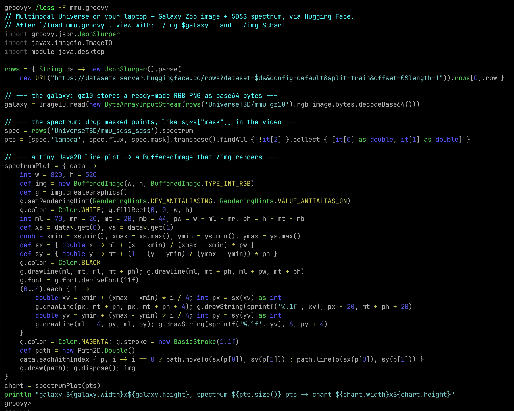
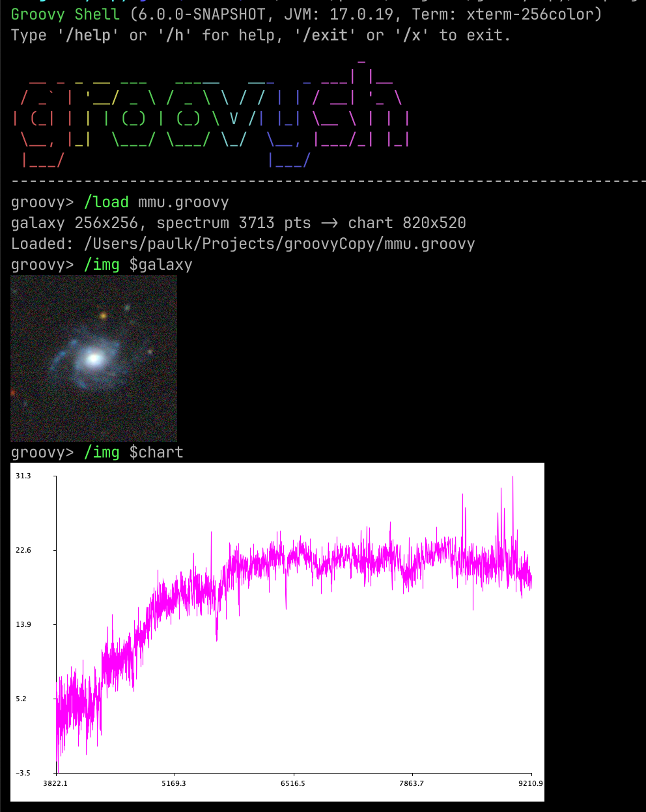

= Exploring the Multimodal Universe with Groovy&trade;
Paul King <paulk-asert|PMC_Member>
:revdate: 2026-07-01T11:00:00+00:00
:keywords: groovy, groovysh, huggingface, astronomy, astrophysics, data science, sixel, java2d, spectrum
:description: Reproduce a viral astronomy demo in groovysh: load galaxy images and spectra from Hugging Face's Multimodal Universe and render them inline with /img.

A recent https://x.com/cgeorgiaw[post on X by Georgia Channing] (@cgeorgiaw) caught our eye:

[quote,Georgia Channing]
____
Seems like no one's noticed the 80TB of astrophysics data from 30+ sources that just dropped on
@huggingface ... and you only need ~4GB of RAM to load it.
We're talking over 80TB of galaxy imagery taken across the spectrum, spectra of galaxies and stars,
time series of variable stars, and a whole zoo of assorted measurements and physical data.
And all of it can now be wrangled on your laptop, thanks to Multimodal Universe's just released
cross-matching.
____

The accompanying video is a lovely little terminal session: open a couple of enormous astronomical
catalogs straight from https://huggingface.co/[Hugging Face], cross-match them, pull out one galaxy,
and _draw the galaxy and its spectrum right there in the terminal_.
That last part — rendering scientific images inline in a REPL — is something Groovy 6 `groovysh` can do too,
via its `/img` command, so let's reproduce the demo.

Full credit to Georgia Channing for the original post, and to
https://x.com/smith42mike[Mike Smith] (@smith42mike) who led the cross-matching work that makes
the https://multimodaluniverse.org/[Multimodal Universe] accessible on a laptop.

== What is the Multimodal Universe?

The https://github.com/MultimodalUniverse/MultimodalUniverse[Multimodal Universe] is a large,
community effort (presented at NeurIPS 2024) that gathers around 100TB of astronomical data from
more than 30 surveys into a single, machine-learning-friendly collection: galaxy images across
multiple wavelength bands, optical spectra of galaxies and stars, time series of variable stars, and
assorted catalog measurements. It is published as a family of datasets on the Hugging Face Hub.

The magic trick behind "wrangle 80TB on a 4GB laptop" is _cross-matching_ with
https://lsdb.readthedocs.io/[LSDB] on top of the https://hats.readthedocs.io/[HATS] format:
the catalogs are spatially partitioned (by position on the sky using HEALPix), so joining
800k objects from SDSS against 122M objects from Gaia only ever needs to hold a few partitions in
memory at a time. You never download the whole thing.

We are going to focus on the visualization half of the demo, using two of the datasets:

* **`UniverseTBD/mmu_gz10`** — galaxy imagery derived from the
https://astronn.readthedocs.io/en/latest/galaxy10.html[Galaxy10 DECaLS] set, which pairs
citizen-science https://www.zooniverse.org/projects/zookeeper/galaxy-zoo/[Galaxy Zoo] morphology
labels with 256&times;256 colour cutouts from the DESI Legacy Imaging Surveys. Each row conveniently
carries a ready-made RGB PNG.
* **`UniverseTBD/mmu_sdss_sdss`** — optical spectra from the
https://www.sdss.org/[Sloan Digital Sky Survey], i.e. flux measured across wavelengths from roughly
3800 to 9200 &#8491;ngstr&ouml;ms, plus a per-pixel `mask` marking bad samples.

We don't even need a Python environment or the datasets locally. Hugging Face exposes a
https://huggingface.co/docs/dataset-viewer[dataset viewer REST API] that streams rows as JSON
straight out of the underlying Parquet — so we can grab a single galaxy with an ordinary HTTP call.
Requesting one row looks like this:

----
https://datasets-server.huggingface.co/rows?dataset=UniverseTBD/mmu_gz10&config=default&split=train&offset=0&length=1
----

In that JSON, the galaxy image comes back as base64-encoded PNG bytes, and the spectrum comes back as
plain arrays of `lambda` (wavelength), `flux`, and `mask` values. Perfect for Groovy.

== Rendering images in groovysh

Groovy's interactive shell, `groovysh`, has been reworked on top of
https://github.com/jline/jline3[JLine 3] and gains a set of `/`-prefixed commands. One of them is
`/img`, which displays an image inline using the terminal's graphics protocol (Sixel, Kitty, or
iTerm2 — terminals like https://iterm2.com/[iTerm2], https://wezterm.org/[WezTerm], or
https://sw.kovidgoyal.net/kitty/[Kitty] all qualify). On a terminal without graphics support it
prints a summary line, and you can add `--gui` to pop up a Swing window instead.

`/img` accepts a file path, an HTTP URL, or a shell variable holding a `java.awt.image.BufferedImage`
(among other things), which is exactly what we need: one command for the galaxy PNG and one for a
chart we build ourselves.

== The script

Here is the complete `mmu.groovy` script. It reads one cross-matched-style row from each dataset,
decodes the galaxy PNG, filters the masked points out of the spectrum (mirroring the video's
`s = s[~s["mask"]]`), and hand-draws the spectrum as a Java2D line plot returned as a
`BufferedImage`:

[source,groovy]
----
import groovy.json.JsonSlurper
import javax.imageio.ImageIO
import module java.desktop

rows = { String ds -> new JsonSlurper().parse(
    new URL("https://datasets-server.huggingface.co/rows?dataset=$ds&config=default&split=train&offset=0&length=1")).rows[0].row }

// --- the galaxy: gz10 stores a ready-made RGB PNG as base64 bytes ---
galaxy = ImageIO.read(new ByteArrayInputStream(rows('UniverseTBD/mmu_gz10').rgb_image.bytes.decodeBase64()))

// --- the spectrum: drop masked points, like s[~s["mask"]] in the video ---
spec = rows('UniverseTBD/mmu_sdss_sdss').spectrum
pts = [spec.'lambda', spec.flux, spec.mask].transpose().findAll { !it[2] }.collect { [it[0] as double, it[1] as double] }

// --- a tiny Java2D line plot -> a BufferedImage that /img renders ---
spectrumPlot = { data ->
    int w = 820, h = 520
    def img = new BufferedImage(w, h, BufferedImage.TYPE_INT_RGB)
    def g = img.createGraphics()
    g.setRenderingHint(RenderingHints.KEY_ANTIALIASING, RenderingHints.VALUE_ANTIALIAS_ON)
    g.color = Color.WHITE; g.fillRect(0, 0, w, h)
    int ml = 70, mr = 20, mt = 20, mb = 44, pw = w - ml - mr, ph = h - mt - mb
    def xs = data*.get(0), ys = data*.get(1)
    double xmin = xs.min(), xmax = xs.max(), ymin = ys.min(), ymax = ys.max()
    def sx = { double x -> ml + (x - xmin) / (xmax - xmin) * pw }
    def sy = { double y -> mt + (1 - (y - ymin) / (ymax - ymin)) * ph }
    g.color = Color.BLACK
    g.drawLine(ml, mt, ml, mt + ph); g.drawLine(ml, mt + ph, ml + pw, mt + ph)
    g.font = g.font.deriveFont(11f)
    (0..4).each { i ->
        double xv = xmin + (xmax - xmin) * i / 4; int px = sx(xv) as int
        g.drawLine(px, mt + ph, px, mt + ph + 4); g.drawString(sprintf('%.1f', xv), px - 20, mt + ph + 20)
        double yv = ymin + (ymax - ymin) * i / 4; int py = sy(yv) as int
        g.drawLine(ml - 4, py, ml, py); g.drawString(sprintf('%.1f', yv), 8, py + 4)
    }
    g.color = Color.MAGENTA; g.stroke = new BasicStroke(1.1f)
    def path = new Path2D.Double()
    data.eachWithIndex { p, i -> i == 0 ? path.moveTo(sx(p[0]), sy(p[1])) : path.lineTo(sx(p[0]), sy(p[1])) }
    g.draw(path); g.dispose(); img
}
chart = spectrumPlot(pts)
println "galaxy ${galaxy.width}x${galaxy.height}, spectrum ${pts.size()} pts -> chart ${chart.width}x${chart.height}"
----

A few things worth pointing out:

* The whole data-access layer is a one-line closure. `JsonSlurper` parses the HTTP response, and
Groovy's GDK gives us `decodeBase64()` on the PNG string for free.
* `transpose()` zips the three parallel arrays (`lambda`, `flux`, `mask`) together so we can
`findAll` the unmasked samples in one readable expression.
* Note the `import module java.desktop` on line 3. This is a
https://openjdk.org/jeps/494[JDK module import] (JEP 494), supported in Groovy 6, that pulls in every
package the `java.desktop` module exports (`java.awt`, `java.awt.geom`, `java.awt.image`, and more) in
a single line — handy for a script that reaches into a few AWT corners.

== Running it

Start `groovysh`, load the script, and view each result with `/img`:

[source,subs="none"]
----
groovy> /load mmu.groovy
galaxy 256x256, spectrum 3713 pts -> chart 820x520
Loaded: mmu.groovy
groovy> /img $galaxy
groovy> /img $chart
----

Here is the script itself, viewed through the shell's built-in `/less` pager (which syntax-highlights
Groovy):

And here is the payoff — a galaxy and its spectrum, drawn directly in the terminal:

== What are we looking at?

The top image is a single galaxy from the Galaxy Zoo / DECaLS set: a bright central bulge with
fainter spiral structure around it, sitting in a field speckled with foreground stars and other
faint sources (the little coloured dots). It is a true-colour composite assembled from the survey's
imaging bands.

The lower plot is that same class of object's SDSS optical spectrum: **flux on the vertical axis
against wavelength (in &#8491;ngstr&ouml;ms) on the horizontal axis**, from about 3800&#8491; on the
left to 9200&#8491; on the right. The characteristic shape — low and noisy in the blue, rising to a
broad, fairly flat continuum toward the red — is the combined light of the galaxy's stellar
populations, with narrow spikes where emission lines and residual sky features poke through. We drew
it in magenta to match the original demo; the thin black vertical hairs you can see are simply the
plot connecting rapidly varying adjacent samples. We removed the flagged (`mask`ed) pixels first, so
3713 good samples remain out of the original ~3850.

The point isn't the plot's polish — it's that a few lines of Groovy pulled a real galaxy and a real
spectrum out of an 80TB, 30-survey collection, over plain HTTP, and painted them in a terminal, with
no local data download and no heavyweight plotting dependency.

== What we didn't reproduce

The original video's headline feat is the *cross-match* itself — joining `gz10` (imagery) against
`sdss` (spectra), or SDSS against Gaia, using LSDB's HATS-partitioned catalogs. That machinery is
Python-native and has no direct JVM equivalent, so here we simply grabbed a representative row from
each dataset rather than computing the spatial join. Everything downstream of the match — decoding
the image, cleaning the spectrum, and rendering both — is pure Groovy and the JDK.

== More information

* The original post: https://x.com/cgeorgiaw[Georgia Channing on X]
* https://multimodaluniverse.org/[The Multimodal Universe] project and its
https://github.com/MultimodalUniverse/MultimodalUniverse[GitHub repository]
* Datasets on Hugging Face:
https://huggingface.co/datasets/UniverseTBD/mmu_gz10[mmu_gz10] and
https://huggingface.co/datasets/UniverseTBD/mmu_sdss_sdss[mmu_sdss_sdss]
* https://huggingface.co/docs/dataset-viewer[The Hugging Face dataset viewer REST API]

== Conclusion

We used a viral astronomy demo as an excuse to show off `groovysh`'s `/img` command, JDK module
imports in Groovy 6, and just how little code it takes to reach into a massive scientific dataset and
visualize it. Go discover some galaxies!
