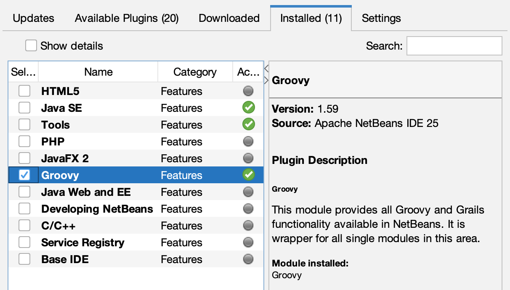
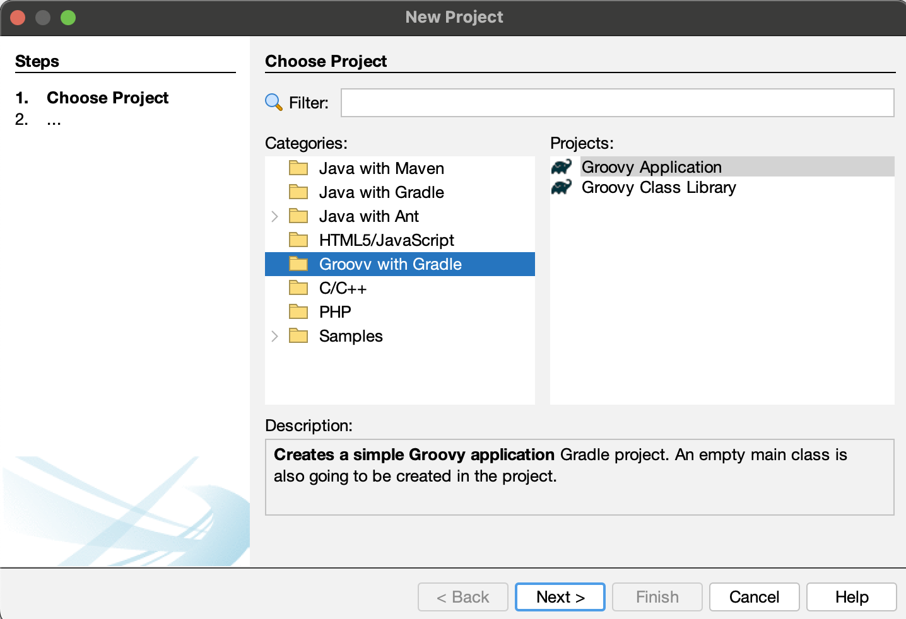
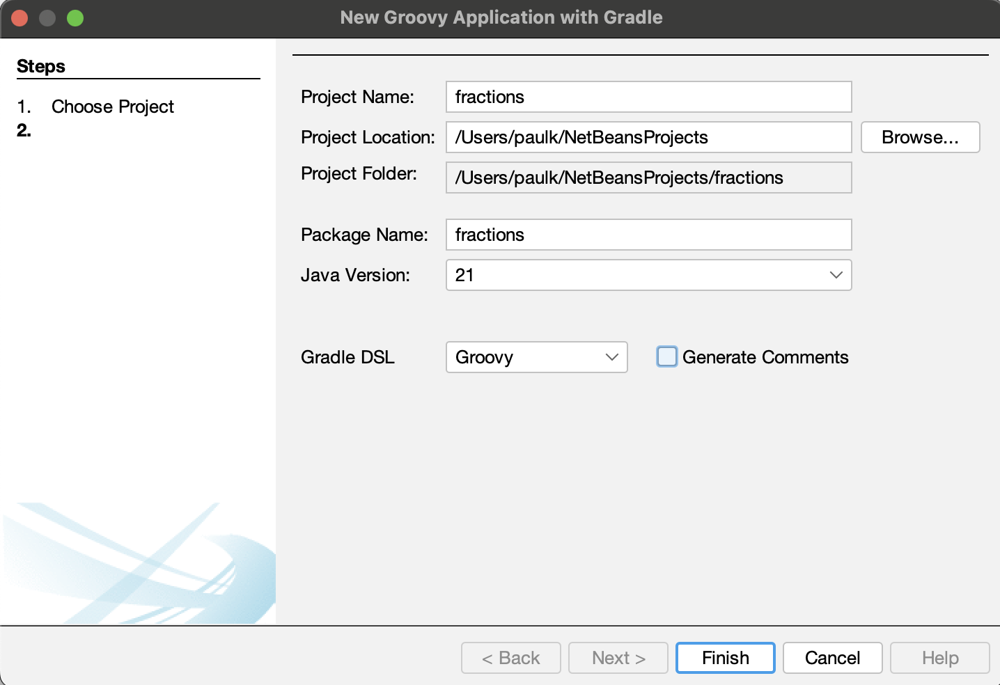
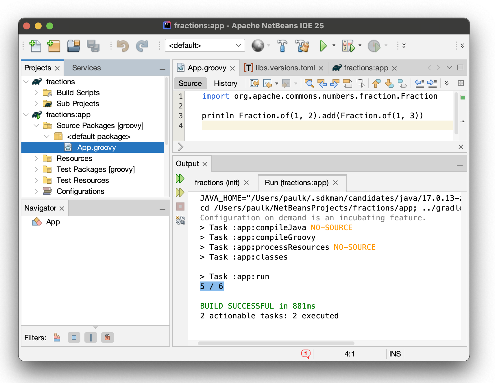
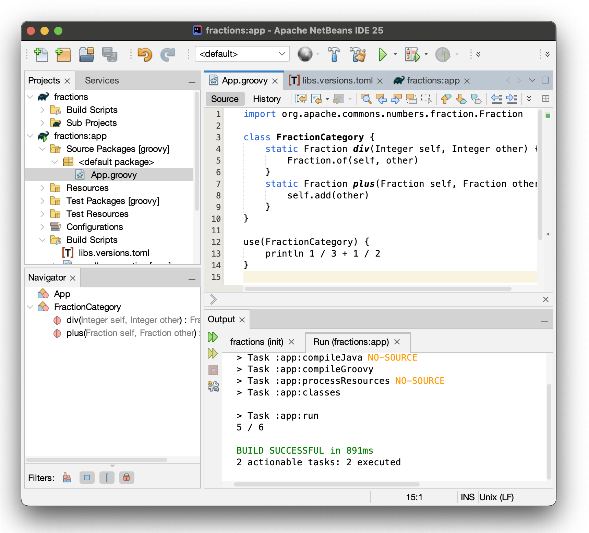
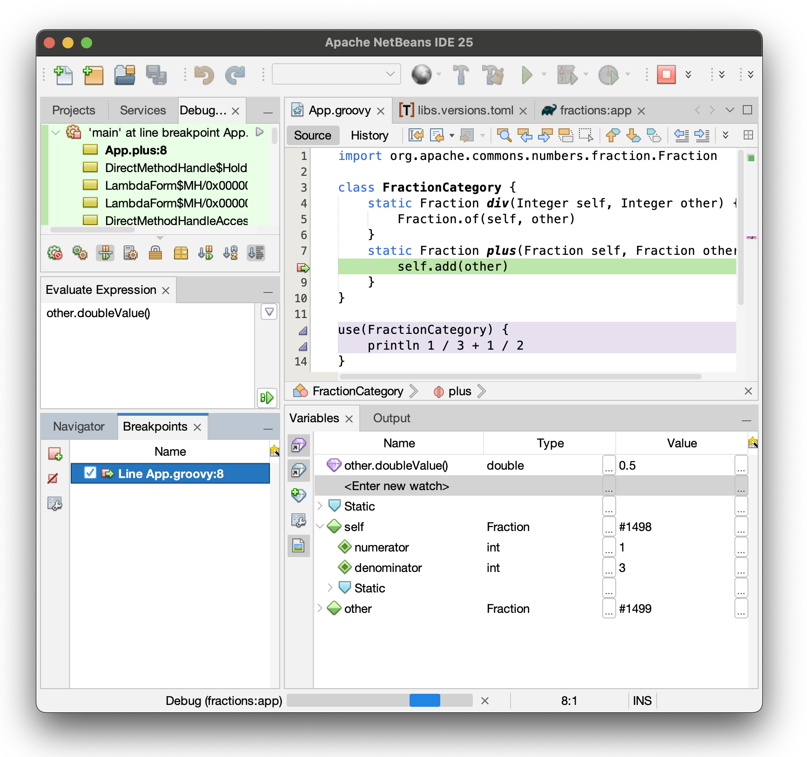
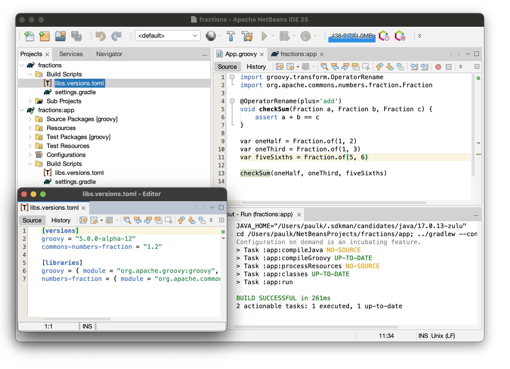

= Using Apache NetBeans with Apache Groovy&trade;
Paul King <paulk-asert|PMC_Member>
:revdate: 2025-02-25T22:15:00+00:00
:keywords: netbeans, groovy, apache, debug, gradle
:description: This post looks at using NetBeans and Groovy.

> [blue]#_Let's try using the latest Apache NetBeans with Apache Groovy._#
>

The https://netbeans.apache.org/[Apache NetBeans] project recently
https://netbeans.apache.org/front/main/blogs/entry/announce-apache-netbeans-25-released/[announced] the release of Apache NetBeans 25. Let's take it for a spin with
https://groovy.apache.org/[Apache Groovy].

We'll assume you have downloaded it as per the
https://netbeans.apache.org/front/main/download/nb25/[NetBeans download page].
If you haven't used NetBeans with Groovy before, you might need to enable
to Groovy plugin. Select `Tools -> Plugins -> Installed`, Check `Groovy` and click on `Activate`, when finished, you should see a screen like this:

Next, we are going to create a new project, select `File -> New Project... -> Groovy with Gradle`.

Select `Groovy Application` then click `Next`.

Now, fill in the project details:

We are going to create a little script that uses some fraction functionality from the
https://commons.apache.org/proper/commons-numbers/[Apache Commons Number] library.
We'll call the project fractions. Click `Finish` when ready.

This now creates a partially filled out project using the Gradle `init` task.
It defines some useful libraries, sets up `test` and `main` source sets for us,
creates a versions catalog, and creates an `app` subproject.
It has set up some nice dependencies like the
https://spockframework.org/[Spock testing framework],
but we won't use that in this post.

So, for our little script, we'll prune back the dependencies to just those we need.
The versions toml file becomes:

[source,toml]
----
[versions]
groovy = "3.0.22"
commons-numbers-fraction = "1.2"

[libraries]
groovy = { module = "org.codehaus.groovy:groovy", version.ref = "groovy" }
numbers-fraction = { module = "org.apache.commons:commons-numbers-fraction", version.ref = "commons-numbers-fraction" }
----

We'll also prune the Gradle build file slightly to this:

[source,groovy]
----
plugins {
    id 'groovy'
    id 'application'
}

repositories {
    mavenCentral()
}

dependencies {
    implementation libs.groovy
    implementation libs.numbers.fraction
}

java {
    toolchain {
        languageVersion = JavaLanguageVersion.of(21)
    }
}

application {
    mainClass = 'App'
}
----

We can now create our script. It's just one _import_ statement
and then one line of code:

Running the script shows the expected output of `5 / 6`. The fractions library
is good at getting exact results which might otherwise be prone to rounding errors.

Let's try a bit of Groovy fun. We'll define a category to make working with fractions a little nicer. Groovy supports a number of _metapgramming_ mechanisms that let you
add methods to classes at compile time or runtime. In this case, we'll add a
`div` method to the `Integer` class and a `plus` method to the `Fraction` class.
These happen to be methods designed to work with Groovy's operator overloading.

The `use` method lets us apply this change to a select code block.
That way we won't impact using the `Integer` and `Fraction` classes
without these changes in other places.

The magic is in the code fragment `println 1 / 3 + 1 / 2`. The expression `1 / 3`
works like a factory method for fractions. The `+` operator adds the fractions.

NOTE: As an aside, Groovy's compiler configuration and scripting support
means that we could hide away the definition of the `FractionCategory`
class and the `use` call if we wanted to, leaving a script with
just the `println 1 / 3 + 1 / 2` statement. This might be appropriate
if we were setting up an environment for data scientists to write
script with fractions.

But we haven't finished yet. IDE's should let us debug our code.
Let's put a breakpoint on the statement in the `plus` method of the
`FractionCategory` class, and then run with debug.

Execution has halted. We can inspect the `self` and `other` variables and
add watch expressions like `other.doubleValue()`.

The default Groovy version generated by the Gradle init invocation earlier
was the latest Groovy 3 version.
But we can easily change that. Let's swap to Groovy 5 (currently in alpha releases)
and look at a new Groovy 5 feature, the `OperatorRename` AST transform.

If provides an alternative to our earlier category. Simplify slightly,
it changes operator overloading in early parsing. You can use operator
overloading in the source code, and it is renamed to normal method
calls, removing the need for subsequent metaprogramming.

So, the `+` in the assert statement at line 6 is converted into
an `add` method call instead of Groovy's normal `plus` operator overloading method call.
You can read more about this new feature in the
https://groovy-lang.org/releasenotes/groovy-5.0.html[Groovy 5 release notes].
