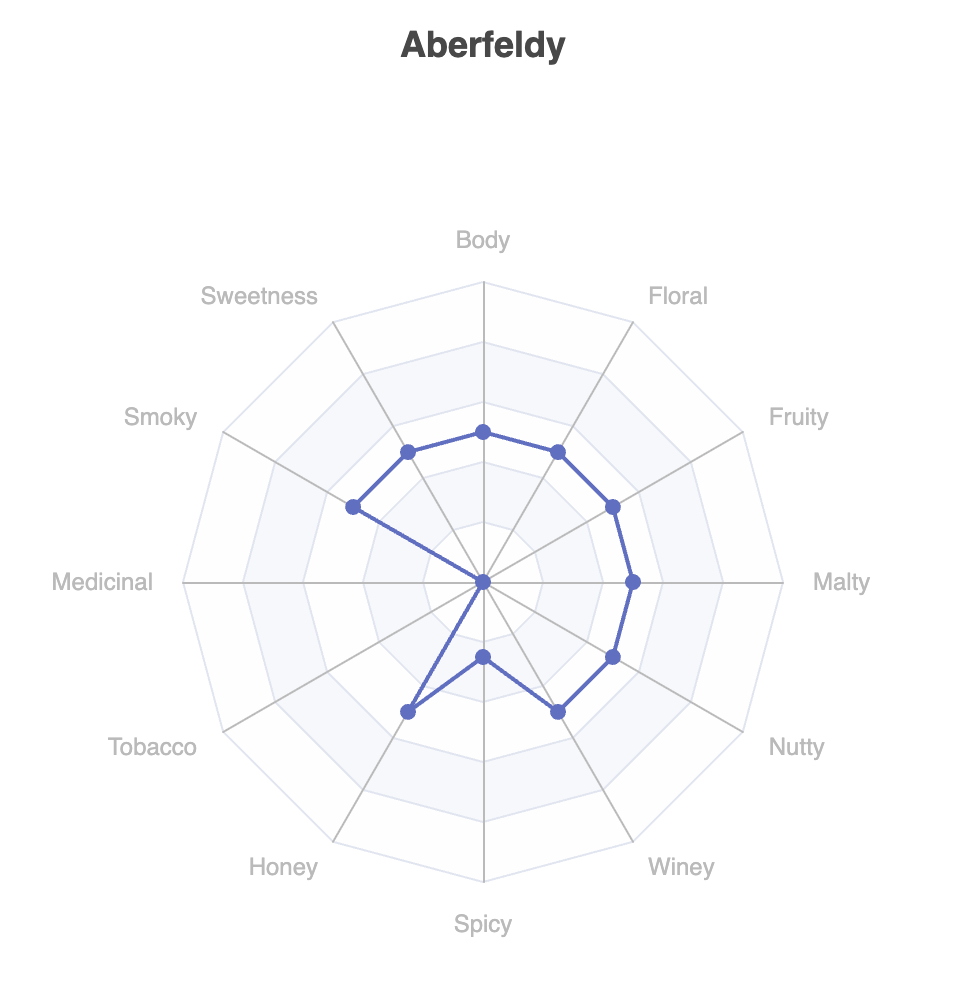
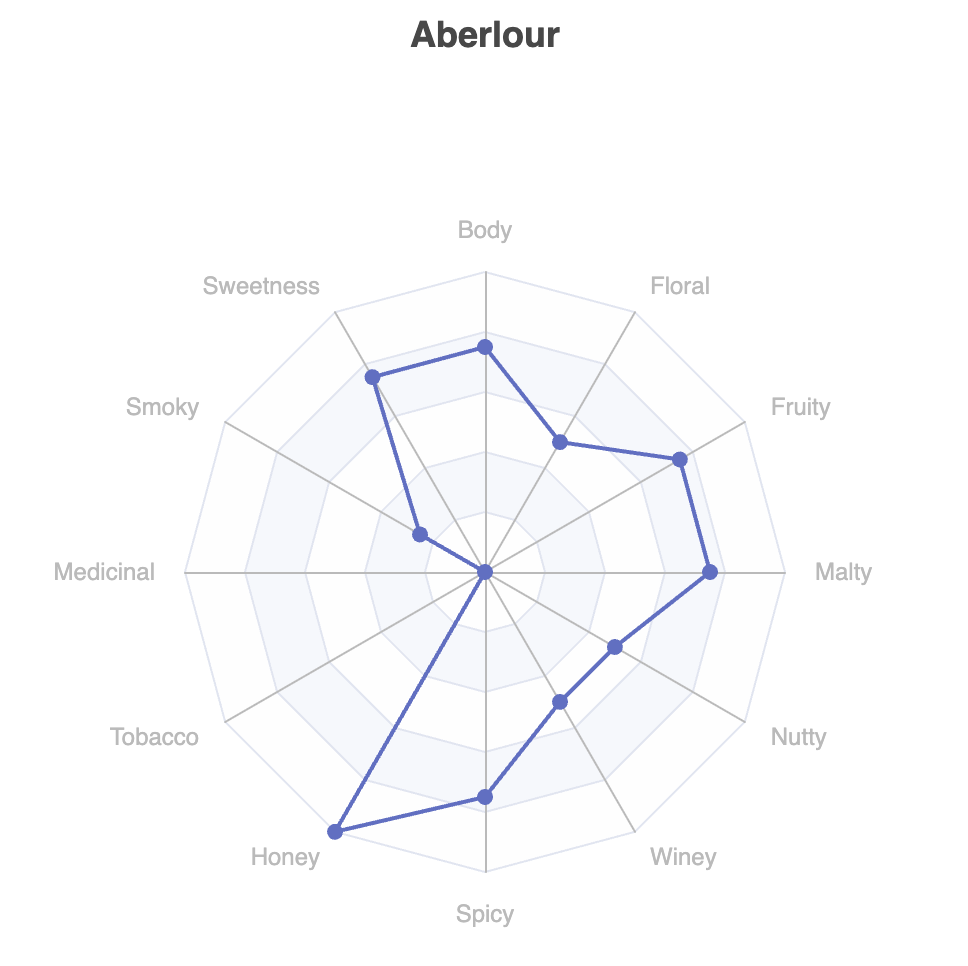
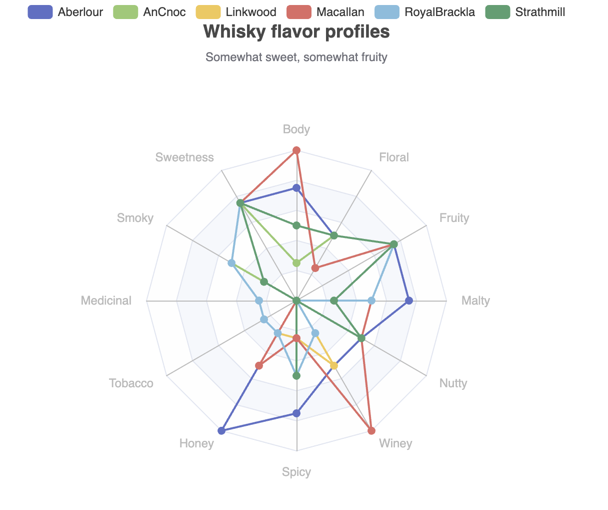
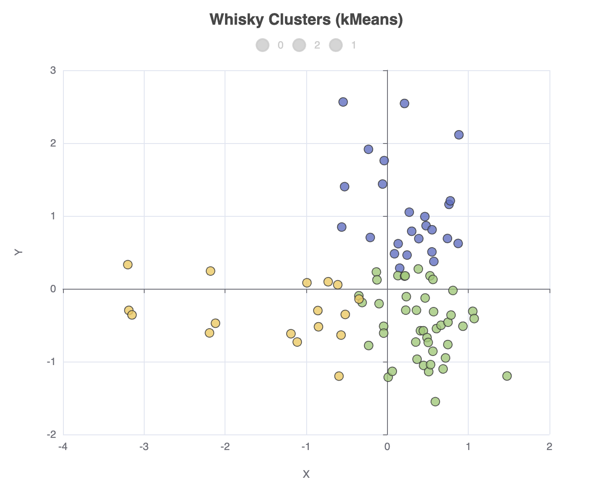
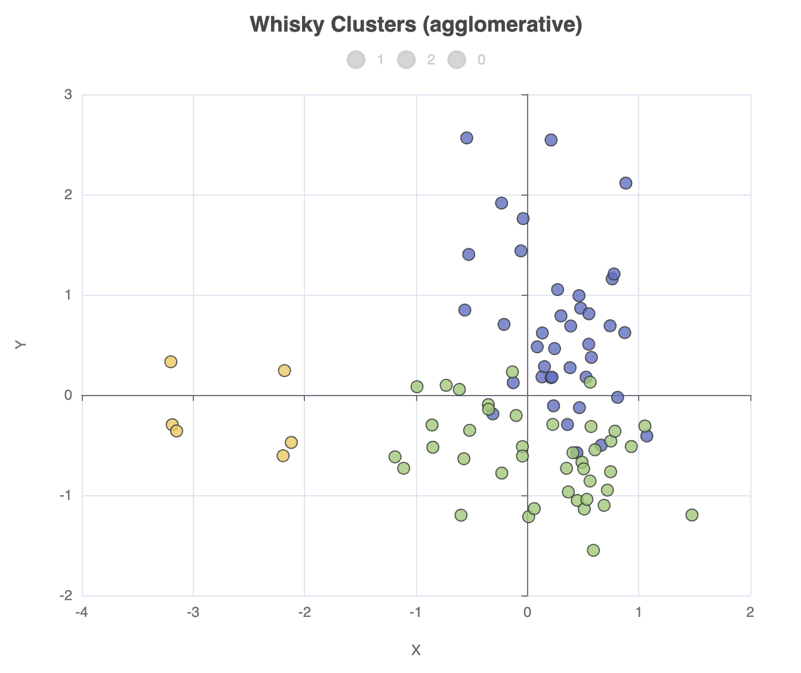
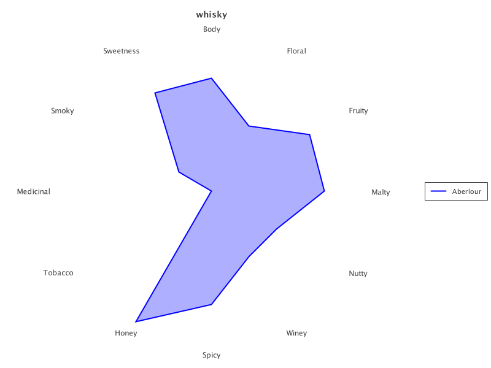
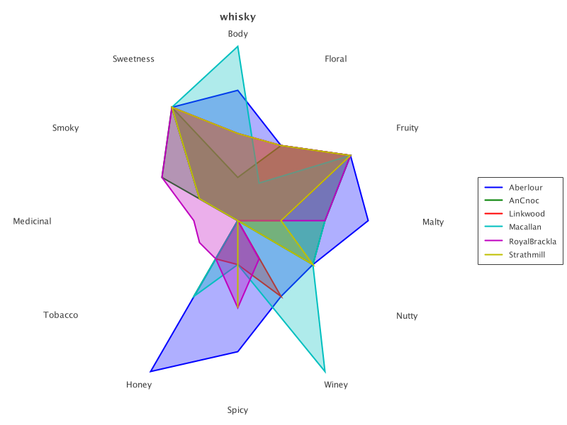
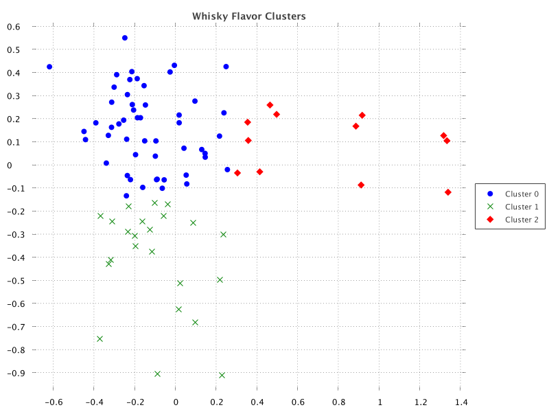
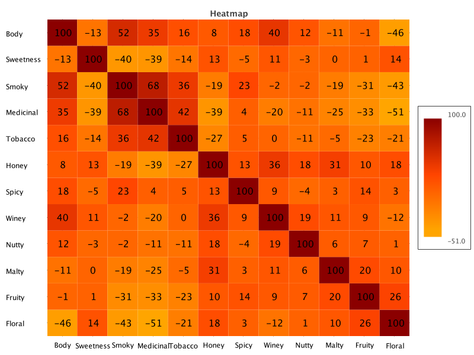

= Whisky flavor profiles revisited
Paul King
:revdate: 2025-04-17T22:30:00+00:00
:draft: true
:keywords: whisky, whiskey, groovy, kmeans, clustering, apache echarts
:description: This post looks at using the Underdog data science library.

++++
<table><tr><td style="padding: 0px; padding-left: 20px; padding-right: 20px; font-size: 18pt; line-height: 1.5; margin: 0px">
++++
[blue]#_Let's take a first look at Underdog and Matrix, two new Groovy powered dataframe libraries.
We'll explore Whisky flavor profiles!_#
++++
</td></tr></table>
++++

In previous blog posts, we have looked at clustering whisky profiles using:

* https://groovy.apache.org/blog/using-groovy-with-apache-wayang[Apache Wayang's cross-platform machine learning] supporting native and Apache Spark™ data processing platforms
* https://groovy.apache.org/blog/whiskey-clustering-with-groovy-and[Apache Ignite's distributed machine learning]

The https://github.com/paulk-asert/groovy-data-science[groovy-data-science] repo also has examples of this case study using other technologies including:

[cols="1,4"]
|===
| Data manipulation
| Tablesaw, Datumbox, Apache Commons CSV, Tribuo

| Clustering
| Smile, Apache Commons Math, Datumbox, Weka, Encog, Elki, Tribuo

| Visualization
| XChart, Tablesaw Plot.ly, Smile visualization, JFreeChart

| Scaling clustering
| Apache Ignite, Apache Spark, Apache Wayang, Apache Flink, Apache Beam
|===

Let's take a first look at two new Groovy powered dataframe libraries,
https://grooviter.github.io/underdog/[Underdog] and
https://github.com/Alipsa/matrix[Matrix],
to explore the same case study.

== The Case Study

image:img/whiskey_bottles.jpg[whisky bottles,180,float="right"]
In the quest to find the perfect single-malt Scotch whisky,
the whiskies produced from
https://www.niss.org/sites/default/files/ScotchWhisky01.txt[86 distilleries]
have been ranked by expert tasters according to 12 criteria
(Body, Sweetness, Malty, Smoky, Fruity, etc.).
We'll use algorithms, like https://en.wikipedia.org/wiki/K-means_clustering[KMeans], to cluster the whiskies
into related groups.

== A first look at Underdog

A relatively new data science library is
https://grooviter.github.io/underdog/[Underdog].
Let's use it to explore Whisky profiles.
It has many Groovy-powered features delivering a very expressive developer experience.

Underdog sits on top of some well-known data-science libraries in the JVM ecosystem
like Smile, Tablesaw, and https://echarts.apache.org/[Apache ECharts].
If you have used any of those libraries, you'll recognise parts of the functionality
shining through.

First, we'll load our CSV file into an Underdog dataframe:

[source,groovy]
----
def file = getClass().getResource('whisky.csv').file
def df = Underdog.df().read_csv(file).drop('RowID')
----

Let's look at the shape of and schema for the data:

[source,groovy]
----
println df.shape()
println df.schema()
----

It gives this output:

----
86 rows X 13 cols
         Structure of whisky.csv
 Index  |  Column Name  |  Column Type  |
-----------------------------------------
     0  |   Distillery  |       STRING  |
     1  |         Body  |      INTEGER  |
     2  |    Sweetness  |      INTEGER  |
     3  |        Smoky  |      INTEGER  |
     4  |    Medicinal  |      INTEGER  |
     5  |      Tobacco  |      INTEGER  |
     6  |        Honey  |      INTEGER  |
     7  |        Spicy  |      INTEGER  |
     8  |        Winey  |      INTEGER  |
     9  |        Nutty  |      INTEGER  |
    10  |        Malty  |      INTEGER  |
    11  |       Fruity  |      INTEGER  |
    12  |       Floral  |      INTEGER  |
----

Let's look at a correlation matrix plot of the data:

[source,groovy]
----
def plot = Underdog.plots()
def features = df.columns - 'Distillery'
plot.correlationMatrix(df[features]).show()
----

Which has this output:

Let's now explore searching for whiskies of a particular flavor,
in this case profiles that are somewhat _fruity_ and somewhat _sweet_ in flavor.

[source,groovy]
----
def selected = df[df['Fruity'] > 2 & df['Sweetness'] > 2]
println selected.shape()
----

We can see that there are 6 such whiskies:

----
6 rows X 13 cols
----

Let's have a look at the flavor profiles as a radar plot.
The `underdog-plots` module has shortcuts making it easy to access the Apache ECharts library.
There is one such shortcut for a radar plot of a single series. Let's look at row 0 of our selected whiskies:

[source,groovy]
----
plot.radar(
    features,
    [4] * features.size(),
    selected[features].toList()[0],
    selected['Distillery'][0]
).show()
----

Which has this output:

This pops up in a browser window for the code shown above, but other output options are also available.

This shows one of our 6 selected whiskies of interest. We could certainly do 5 other similar plots.
The library (currently) doesn't have a pre-built chart with multiple series all displayed together,
but the library is built in a fairly flexible manner, and we can reach down one layer and
build such a chart ourselves with not too much work:

[source,groovy]
----
def multiRadar = Chart.createGridOptions('Whisky flavor profiles',
    'Somewhat sweet, somewhat fruity') +
create {
    radar {
        radius('50%')
        indicator(features.zip([4] * features.size())
            .collect { n, mx -> [name: n, max: mx] })
    }
    selected.toList().each { row ->
        series(RadarSeries) {
            data([[name: row[0], value: row[1..-1]]])
        }
    }
}.customize {
    legend {
        show(true)
    }
}
plot.show(multiRadar)
----

Which has this output:

It can often be infuriating when a library doesn't offer a feature you need,
so it's great that we can add such a feature on the fly!

Let's now cluster the distilleries using k-means, and place the cluster allocations back into the dataframe:

[source,groovy]
----
def ml = Underdog.ml()
def d = df[features] as double[][]
def clusters = ml.clustering.kMeans(d, nClusters: 3)
df['Cluster'] = clusters.toList()
----

Underdog offers some aggregation functions, so we can check the counts for the cluster allocation:

[source,groovy]
----
println df.agg([Distillery:'count'])
    .by('Cluster')
    .rename('Whisky Cluster Sizes')
----

Or, we can easily print out the distilleries in each cluster:

[source,groovy]
----
println 'Clusters'
for (int i in clusters.toSet()) {
    println "$i:${df[df['Cluster'] == i]['Distillery'].join(', ')}"
}
----

Which gives the following output:

----
Clusters
0:Aberfeldy, Aberlour, Auchroisk, Balmenach, Belvenie, BenNevis, Benrinnes, Benromach, BlairAthol, Dailuaine, Dalmore, Edradour, GlenOrd, Glendronach, Glendullan, Glenfarclas, Glenlivet, Glenrothes, Glenturret, Knochando, Longmorn, Macallan, Mortlach, RoyalLochnagar, Strathisla
1:Ardbeg, Balblair, Bowmore, Bruichladdich, Caol Ila, Clynelish, GlenGarioch, GlenScotia, Highland Park, Isle of Jura, Lagavulin, Laphroig, Oban, OldPulteney, Springbank, Talisker, Teaninich
2:AnCnoc, Ardmore, ArranIsleOf, Auchentoshan, Aultmore, Benriach, Bladnoch, Bunnahabhain, Cardhu, Craigallechie, Craigganmore, Dalwhinnie, Deanston, Dufftown, GlenDeveronMacduff, GlenElgin, GlenGrant, GlenKeith, GlenMoray, GlenSpey, Glenallachie, Glenfiddich, Glengoyne, Glenkinchie, Glenlossie, Glenmorangie, Inchgower, Linkwood, Loch Lomond, Mannochmore, Miltonduff, OldFettercairn, RoyalBrackla, Scapa, Speyburn, Speyside, Strathmill, Tamdhu, Tamnavulin, Tobermory, Tomatin, Tomintoul, Tomore, Tullibardine
----

It's very hard to visualize 12 dimensional data,
so let's project our data onto 2 dimensions using PCA and store those projections back into the dataframe:

[source,groovy]
----
def pca = ml.features.pca(d, 2)
def projected = pca.apply(d)
df['X'] = projected*.getAt(0)
df['Y'] = projected*.getAt(1)
----

We can now create a scatter plot of this data as follows:

[source,groovy]
----
plot.scatter(
    df['X'],
    df['Y'],
    df['Cluster'],
    'Whisky Clusters (kMeans)'
).show()
----

The output looks like this:

We can go and change our clustering algorithm, e.g. `ml.clustering.agglomerative(d, nClusters: 3)`,
in which case the cluster allocation counts will look like this:

----
       Whisky Cluster Sizes
 Cluster  |  Count [Distillery]  |
----------------------------------
       1  |                  39  |
       2  |                  41  |
       0  |                   6  |
----

And the scatter plot looks like this:

== A first look at Matrix

The
https://github.com/Alipsa/matrix/tree/main[Matrix]
library makes it easy to work with a matrix of tabular data.

Let's read in our data and explore its size:

[source,groovy]
----
def url = getClass().getResource('whisky.csv')
Matrix m = CsvImporter.importCsv(url).dropColumns('RowID')
println m.dimensions()
----

This outputs:

----
[observations:86, variables:13]
----

Currently, the data is all strings. Matrix provides a `convert` option for getting data
into the right type including handling missing values. It also has powerful normalization
functionality. We'll want to normalize our data because some of the algorithms and certainly
the radar plot assume normalized data (values between 0 and 1).

But, here we'll show off the `apply` functionality which will convert and normalize all-in-one
by hand:

[source,groovy]
----
def features = m.columnNames() - 'Distillery'
def size = features.size()
features.each { feature ->
    m.apply(feature) { it.toDouble() / 4 }
}
----

Now, like we did with Underdog, we want to perform a query to find the
whiskies which are somewhat _fruity_ and somewhat _sweet_ in flavor:

[source,groovy]
----
def selected= m.subset{ it.Fruity > 0.5 && it.Sweetness > 0.5 }
println selected.dimensions()
println selected.head(10)
----

Which has this output:

----
[observations:6, variables:13]
Distillery  	Body	Sweetness	Smoky	Medicinal	Tobacco	Honey	Spicy	Winey	Nutty	Malty	Fruity	Floral
Aberlour    	0.75	     0.75	 0.25	      0.0	    0.0	  1.0	 0.75	  0.5	  0.5	 0.75	  0.75	   0.5
AnCnoc      	0.25	     0.75	  0.5	      0.0	    0.0	  0.5	  0.0	  0.0	  0.5	  0.5	  0.75	   0.5
Linkwood    	 0.5	     0.75	 0.25	      0.0	    0.0	 0.25	 0.25	  0.5	  0.0	 0.25	  0.75	   0.5
Macallan    	 1.0	     0.75	 0.25	      0.0	    0.0	  0.5	 0.25	  1.0	  0.5	  0.5	  0.75	  0.25
RoyalBrackla	 0.5	     0.75	  0.5	     0.25	   0.25	 0.25	  0.5	 0.25	  0.0	  0.5	  0.75	   0.5
Strathmill  	 0.5	     0.75	 0.25	      0.0	    0.0	  0.0	  0.5	  0.0	  0.5	 0.25	  0.75	   0.5
----

We can do a radar plot for just the first:

[source,groovy]
----
def transparency = 80
def aberlour = selected.subset(0..0)
def rc = RadarChart.create(aberlour).addSeries('Distillery', transparency)
new SwingWrapper(rc.exportSwing().chart).displayChart()
----

The output looks like this:

Or, for all selected whiskies:

[source,groovy]
----
rc = RadarChart.create(selected).addSeries('Distillery', transparency)
new SwingWrapper(rc.exportSwing().chart).displayChart()
----

Which looks like this:

Let's now apply K-Means, placing the allocated clusters back into the matrix:

[source,groovy]
----
def iterations = 20
def data = m.selectColumns(*features) as double[][]
def model = KMeans.fit(data,3, iterations)
m['Cluster'] = model.group().toList()
----

We can also project onto two dimensions using PCA:

[source,groovy]
----
def pca = PCA.fit(data)
def projected = pca.getProjection(2).apply(data)
m['X'] = projected*.getAt(0)
m['Y'] = projected*.getAt(1)
----

We've placed the projected coordinates back into the matrix.
Let's now create a scatter plot with the distilleries for each cluster
added in distinct series:

[source,groovy]
----
def clusters = m['Cluster'].toSet()
def sc = ScatterChart.create(m)
sc.title = 'Whisky Flavor Clusters'
for (i in clusters) {
    def series = m.subset('Cluster', i)
    sc.addSeries("Cluster $i", series.column('X'), series.column('Y'))
}
new SwingWrapper(sc.exportSwing().chart).displayChart()
----

When run, we get the following output:

Matrix doesn't have a correlation heatmap out of the box, but it does have heatmap plots,
and it does have correlation functionality.
It's easy enough to roll our own:

[source,groovy]
----
def corr = [size<..0, 0..<size].combinations().collect { i, j ->
    Correlation.cor(data*.getAt(j), data*.getAt(i)) * 100 as int
}

def corrMatrix = Matrix.builder().data(X: 0..<corr.size(), Heat: corr)
    .types([Number] * 2)
    .matrixName('Heatmap')
    .build()

def hc = HeatmapChart.create(corrMatrix)
    .addSeries('Heat Series', features.reverse(), features,
        corrMatrix.column('Heat').collate(size))
hc.exportPng('matrixWhiskyCorrHeatmap.png' as File)
new SwingWrapper(hc.exportSwing().chart).displayChart()
----

Which has this output:

== Further information

* https://grooviter.github.io/underdog/[Underdog]
* https://github.com/paulk-asert/whisky-underdog[source code for Underdog examples]
* https://github.com/Alipsa/matrix/tree/main[Matrix]
* https://github.com/paulk-asert/whisky-matrix[source code for Matrix examples]

== Conclusion

We have looked at how to use Underdog and Matrix.

.Update history
****
*19/Apr/2025*: Initial version +
****
