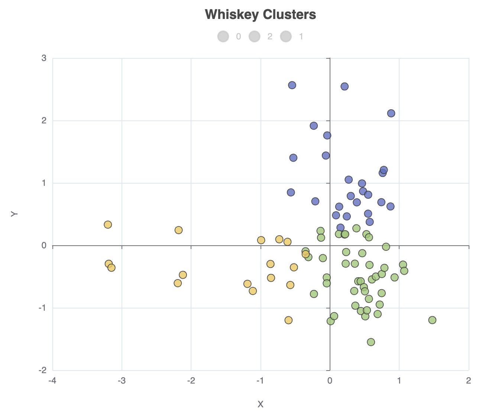

= A first look at Underdog
Paul King
:revdate: 2025-04-17T22:30:00+00:00
:draft: true
:keywords: whisky, groovy, kmeans, clustering
:description: This post looks at using the Underdog data science library.

++++
<table><tr><td style="padding: 0px; padding-left: 20px; padding-right: 20px; font-size: 18pt; line-height: 1.5; margin: 0px">
++++
[blue]#_Let's explore Whisky profiles using Underdog!_#
++++
</td></tr></table>
++++

A relatively new data science library is
https://grooviter.github.io/underdog/[Underdog].
Let's use it to explore Whiskey profiles.
It has many Groovy-powered features delivering a very expressive developer experience.

Underdog sits on top of some well-known data-science libraries like Smile, Tablesaw, and Apache eCharts.
If you have used any of those libraries, you'll recognise parts of the functionality.

First, we'll load our CSV file:

[source,groovy]
----
def file = new File(getClass().classLoader.getResource('whiskey.csv').file)
def df = Underdog.df().read_csv(file.path).drop('RowID')
----

Let's look at the shape of and schema for the data:

[source,groovy]
----
println df.shape()
println df.schema()
----

It gives this output:

----
86 rows X 13 cols
        Structure of whiskey.csv
 Index  |  Column Name  |  Column Type  |
-----------------------------------------
     0  |   Distillery  |       STRING  |
     1  |         Body  |      INTEGER  |
     2  |    Sweetness  |      INTEGER  |
     3  |        Smoky  |      INTEGER  |
     4  |    Medicinal  |      INTEGER  |
     5  |      Tobacco  |      INTEGER  |
     6  |        Honey  |      INTEGER  |
     7  |        Spicy  |      INTEGER  |
     8  |        Winey  |      INTEGER  |
     9  |        Nutty  |      INTEGER  |
    10  |        Malty  |      INTEGER  |
    11  |       Fruity  |      INTEGER  |
    12  |       Floral  |      INTEGER  |
----

Let's look at a correlation matrix plot of the data:

[source,groovy]
----
def plot = Underdog.plots()
def features = df.columns - 'Distillery'
plot.correlationMatrix(df[features]).show()
----

Which has this output:

image:img/underdogCorrelationPlot.png[correlation plot,50%]

We can also look at the data for any individual distillery using a radar plot. Let's look at it for row 0:

[source,groovy]
----
def data = df[features] as double[][]
plot.radar(
    features,
    [4] * features.size(),
    data[0].toList(),
    df['Distillery'][0]
).show()
----

Which has this output:

image:img/underdogCorrelationPlot.png[radar plot,50%]

Let's now cluster the distilleries using k-means:

[source,groovy]
----
def ml = Underdog.ml()
def clusters = ml.clustering.kMeans(data, nClusters: 3)
df['Cluster'] = clusters.toList()

println 'Clusters'
for (int i in clusters.toSet()) {
    println "$i:${df[df['Cluster'] == i]['Distillery'].join(', ')}"
}
----

It gives the following output:

----
Clusters
0:Aberfeldy, Aberlour, Auchroisk, Balmenach, Belvenie, BenNevis, Benrinnes, Benromach, BlairAthol, Dailuaine, Dalmore, Edradour, GlenOrd, Glendronach, Glendullan, Glenfarclas, Glenlivet, Glenrothes, Glenturret, Knochando, Longmorn, Macallan, Mortlach, RoyalLochnagar, Strathisla
1:Ardbeg, Balblair, Bowmore, Bruichladdich, Caol Ila, Clynelish, GlenGarioch, GlenScotia, Highland Park, Isle of Jura, Lagavulin, Laphroig, Oban, OldPulteney, Springbank, Talisker, Teaninich
2:AnCnoc, Ardmore, ArranIsleOf, Auchentoshan, Aultmore, Benriach, Bladnoch, Bunnahabhain, Cardhu, Craigallechie, Craigganmore, Dalwhinnie, Deanston, Dufftown, GlenDeveronMacduff, GlenElgin, GlenGrant, GlenKeith, GlenMoray, GlenSpey, Glenallachie, Glenfiddich, Glengoyne, Glenkinchie, Glenlossie, Glenmorangie, Inchgower, Linkwood, Loch Lomond, Mannochmore, Miltonduff, OldFettercairn, RoyalBrackla, Scapa, Speyburn, Speyside, Strathmill, Tamdhu, Tamnavulin, Tobermory, Tomatin, Tomintoul, Tomore, Tullibardine
----

Finally, let's project our data onto 2 dimensions using PCA and plot that as a scatter plot:

[source,groovy]
----
def pca = ml.features.pca(data, 2)
def projected = pca.apply(data)

df['X'] = projected*.getAt(0)
df['Y'] = projected*.getAt(1)

plot.scatter(
    df['X'],
    df['Y'],
    df['Cluster'],
    'Whiskey Clusters'
).show()
----

The output looks like this:

== Further information

* https://grooviter.github.io/underdog/[Underdog]

== Conclusion

We have looked at how to use Underdog.

.Update history
****
*17/Apr/2025*: Initial version +
****
